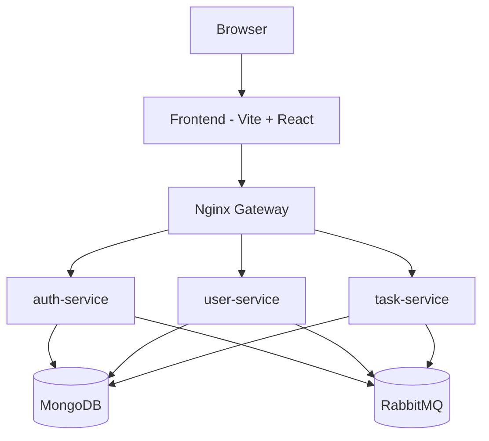
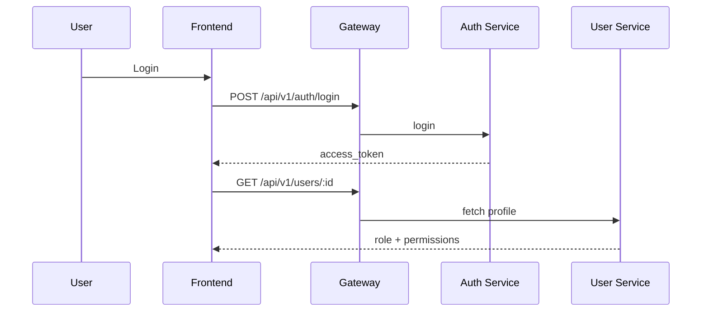

# System Architecture

## Overview
This document summarizes the end-to-end architecture for AuthDB, covering the frontend SPA, the Nginx gateway, and the FastAPI microservices.

## High-Level Topology

## Frontend Architecture
- React + TypeScript SPA with routes for login, register, dashboard, and admin panel.
- Auth state is managed by `AuthContext`, which decodes JWTs and hydrates user permissions from `/users/:id`.
- Permission gates hide UI actions when the user lacks `read:tasks`, `write:tasks`, `delete:tasks`, or `manage:users`.
- The API client sends `Authorization: Bearer <token>` to the gateway at `/api/v1`.

## Gateway Responsibilities
- Routes `/api/v1/auth/*` to `auth-service`.
- Routes `/api/v1/users/*` to `user-service`.
- Routes `/api/v1/tasks/*` to `task-service`.
- Exposes health endpoints for each service via `/api/v1/health/*`.

## Backend Services

### auth-service
- Handles registration and login.
- Issues JWT access tokens.
- Publishes auth events to RabbitMQ.

### user-service
- Admin-only CRUD for users.
- Stores roles and permissions.
- Hosts an RPC server for user lookups.

### task-service
- CRUD for tasks.
- Enforces ownership and permission checks (`read:tasks`, `write:tasks`, `delete:tasks`).
- Requires valid JWTs for all task operations.

## Authentication and Permissions Flow

## Data Model Summary
- Users: email, role, permissions, created_at.
- Tasks: title, description, owner_id, created_at.

## Related Docs
- Frontend details: docs/Front-End.md
- Backend details: docs/Back-End.md
- Database schema: docs/DB_Schema.md
