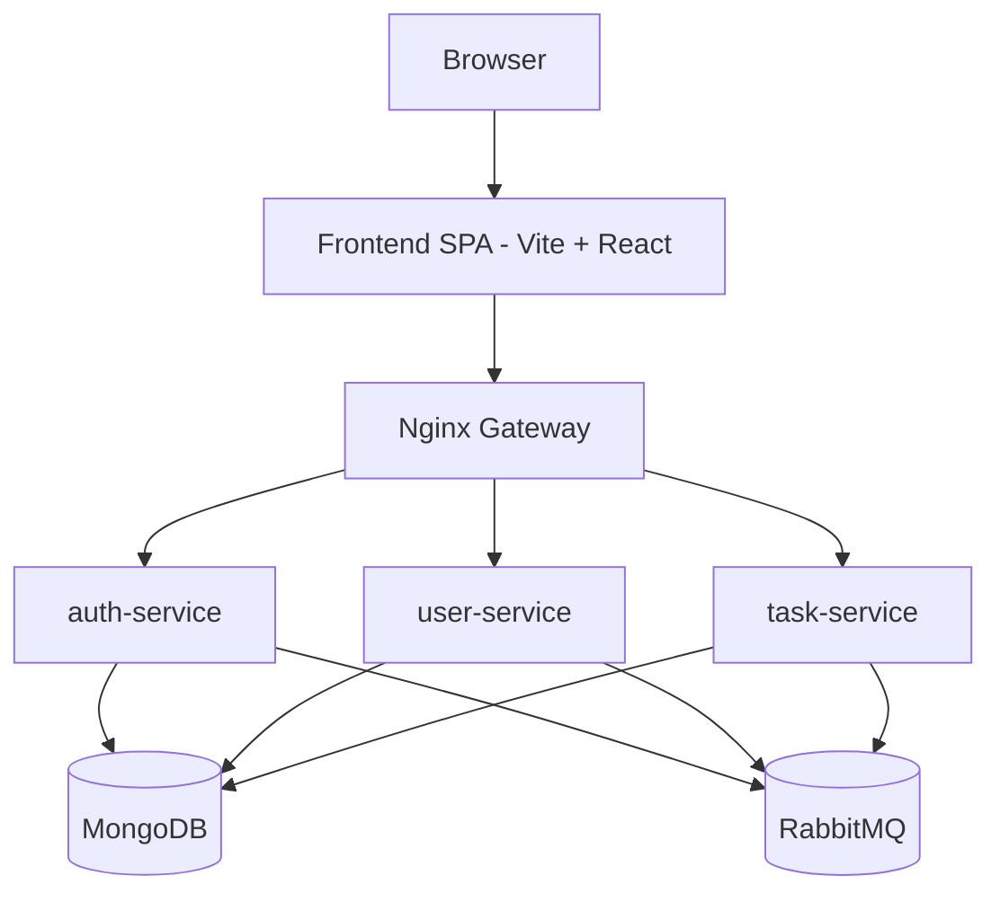
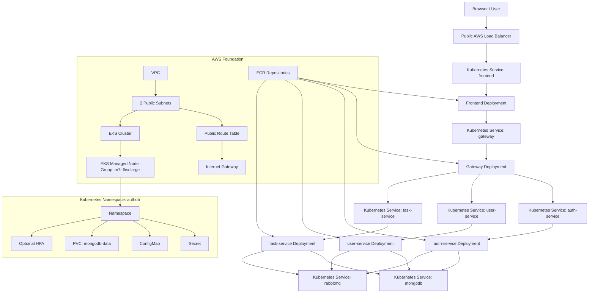
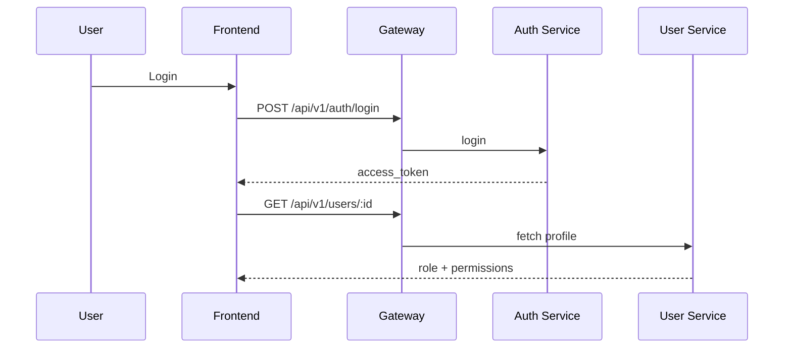
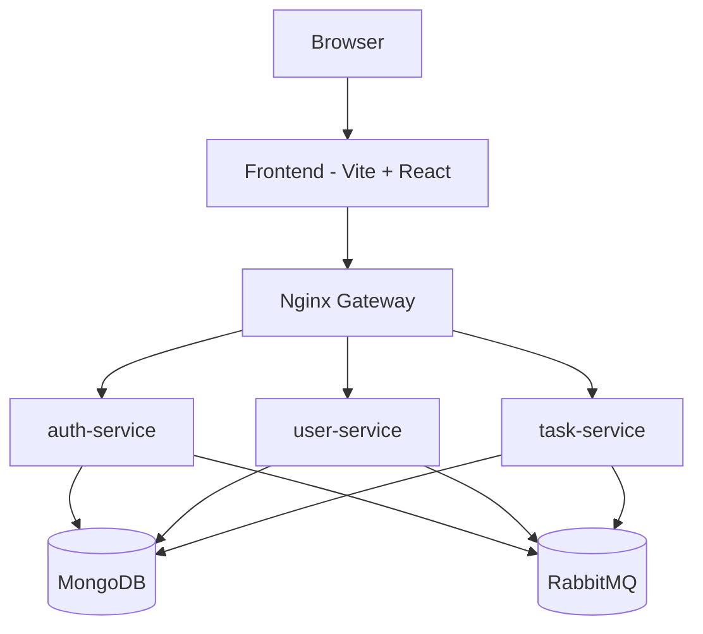

# System Architecture

## Overview
AuthDB is a full-stack application built around a React frontend, an Nginx gateway, and three FastAPI services deployed on AWS EKS. Terraform owns the AWS foundation, the ECR repositories, and the Kubernetes workloads, so the architecture diagram and the infrastructure stay aligned.

## Application Topology

## AWS Deployment Topology

## Frontend Architecture
- React + TypeScript SPA with routes for login, register, dashboard, and admin panel.
- Auth state is managed by `AuthContext`, which decodes JWTs and hydrates user permissions from `/users/:id`.
- Permission gates hide UI actions when the user lacks `read:tasks`, `write:tasks`, `delete:tasks`, or `manage:users`.
- The API client sends `Authorization: Bearer <token>` to the gateway at `/api/v1`.

## Gateway Responsibilities
- Routes `/api/v1/auth/*` to `auth-service`.
- Routes `/api/v1/users/*` to `user-service`.
- Routes `/api/v1/tasks/*` to `task-service`.
- Exposes health endpoints for each service via `/api/v1/health/*`.

## Backend Services

### auth-service
- Handles registration and login.
- Issues JWT access tokens.
- Publishes auth events to RabbitMQ.

### user-service
- Admin-only CRUD for users.
- Stores roles and permissions.
- Hosts an RPC server for user lookups.

### task-service
- CRUD for tasks.
- Enforces ownership and permission checks (`read:tasks`, `write:tasks`, `delete:tasks`).
- Requires valid JWTs for all task operations.

## Terraform Layer Map

| Layer | Terraform files | Purpose |
| --- | --- | --- |
| Network | `networking.tf`, `variables.tf` | VPC, public subnets, internet gateway, public route table, CIDR controls |
| Identity and compute | `iam.tf`, `eks.tf` | IAM roles, EKS cluster, managed node group, EKS add-ons |
| Container registry | `ecr.tf`, `outputs.tf` | ECR repositories and output values for image publishing |
| Kubernetes base | `kubernetes.tf` | Namespace, Secret, ConfigMap, PVC, and shared Kubernetes resources |
| Kubernetes workloads | `kubernetes-apps.tf`, `kubernetes-services.tf` | Deployments, Services, and optional HPA |
| Documentation outputs | `outputs.tf` | Values used by docs, scripts, and deployment helpers |

## Authentication and Permissions Flow

## Terraform to Mermaid Workflow
1. Apply the AWS foundation and ECR repositories with `terraform apply` in `terraform/aws-eks`.
2. Build and push the application images with the generated ECR repository URLs.
3. Enable `deploy_kubernetes = true` and apply again to create the Kubernetes workloads.
4. Regenerate the architecture summary with `bash scripts/terraform-to-mermaid.sh > docs/aws-architecture.generated.md` when the Terraform outputs change.

## Data Model Summary
- Users: email, role, permissions, created_at.
- Tasks: title, description, owner_id, created_at.

## Related Docs
- Frontend details: docs/Front-End.md
- Backend details: docs/Back-End.md
- Database schema: docs/DB_Schema.md
- CloudFormation template: cloudformation/authdb-eks-architecture.yaml
# System Architecture

## Overview
This document summarizes the end-to-end architecture for AuthDB, covering the frontend SPA, the Nginx gateway, and the FastAPI microservices.

## High-Level Topology

## Frontend Architecture
- React + TypeScript SPA with routes for login, register, dashboard, and admin panel.
- Auth state is managed by `AuthContext`, which decodes JWTs and hydrates user permissions from `/users/:id`.
- Permission gates hide UI actions when the user lacks `read:tasks`, `write:tasks`, `delete:tasks`, or `manage:users`.
- The API client sends `Authorization: Bearer <token>` to the gateway at `/api/v1`.

## Gateway Responsibilities
- Routes `/api/v1/auth/*` to `auth-service`.
- Routes `/api/v1/users/*` to `user-service`.
- Routes `/api/v1/tasks/*` to `task-service`.
- Exposes health endpoints for each service via `/api/v1/health/*`.

## Backend Services

### auth-service
- Handles registration and login.
- Issues JWT access tokens.
- Publishes auth events to RabbitMQ.

### user-service
- Admin-only CRUD for users.
- Stores roles and permissions.
- Hosts an RPC server for user lookups.

### task-service
- CRUD for tasks.
- Enforces ownership and permission checks (`read:tasks`, `write:tasks`, `delete:tasks`).
- Requires valid JWTs for all task operations.

## Authentication and Permissions Flow

## Data Model Summary
- Users: email, role, permissions, created_at.
- Tasks: title, description, owner_id, created_at.

## Related Docs
- Frontend details: docs/Front-End.md
- Backend details: docs/Back-End.md
- Database schema: docs/DB_Schema.md
