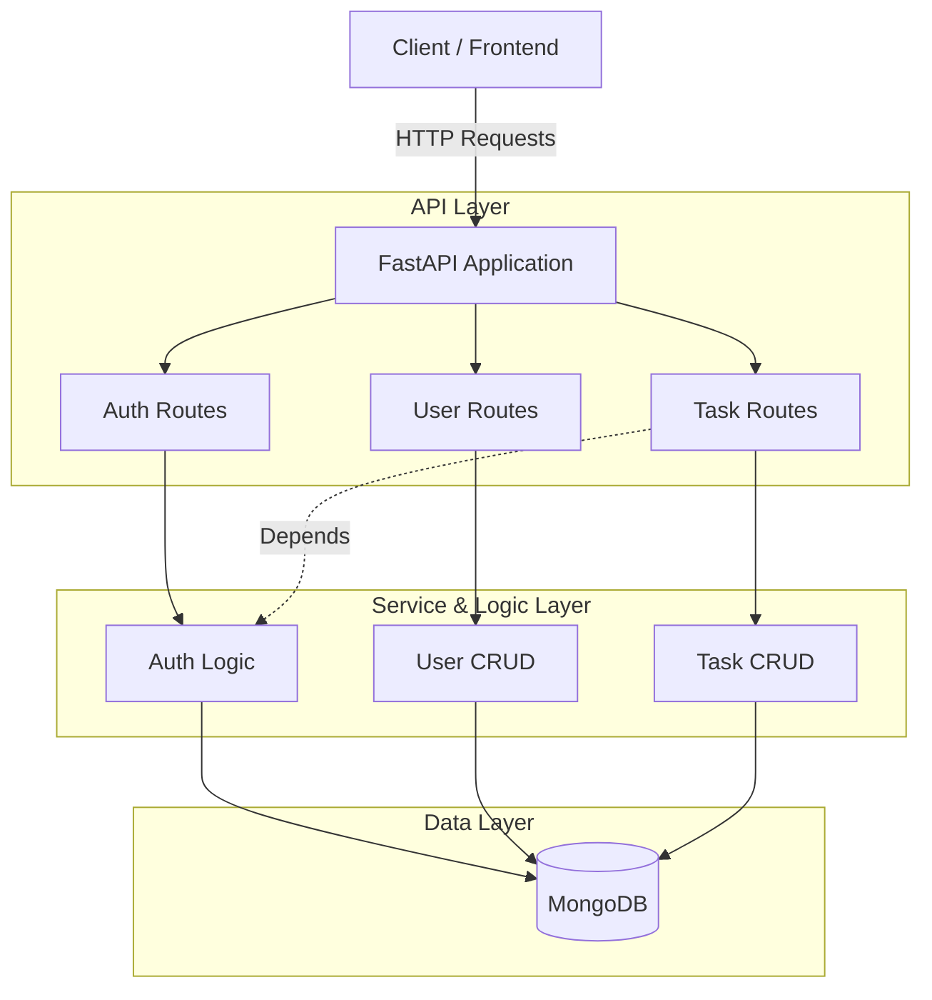
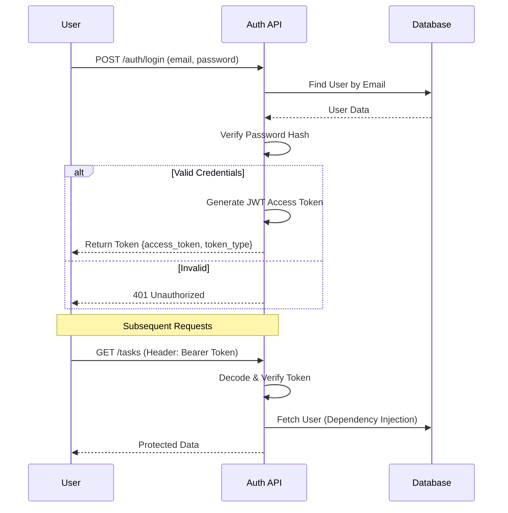

# Backend Documentation

## Overview
The backend is a high-performance REST API built with **FastAPI** and **MongoDB**. It handles user authentication, task management, and enforces role-based access control.

## Tech Stack
- **Framework**: FastAPI (Python 3.10+)
- **Database**: MongoDB (Motor / Pymongo)
- **Authentication**: JWT (JSON Web Tokens) with OAuth2 Password Bearer
- **Validation**: Pydantic Models
- **Security**: Passlib (Bcrypt)

## Architecture

The backend follows a modular architecture separating routes, business logic, and database interactions.

## Authentication Flow

We use JWT for stateless authentication.

## Key Components

### 1. Database Connection (`app/db/mongodb.py`)
Handles the asynchronous connection to MongoDB using `motor`. It connects on startup and closes on shutdown.

### 2. Authentication (`app/routes/auth.py`)
- **Login**: Validates credentials and returns a JWT.
- **Register**: Creates a new user with a hashed password.

### 3. Dependencies (`app/core/dependencies.py`)
- `get_current_user`: Decodes the JWT from the request header and retrieves the user context. This is what secures the endpoints.

### 4. Task Management (`app/routes/tasks.py`)
- Implements CRUD operations.
- Enforces ownership: Users can only see/edit their own tasks.
- **Admin Override**: Admins can see/delete all tasks.
