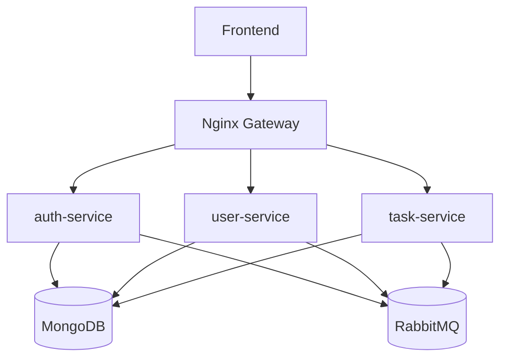
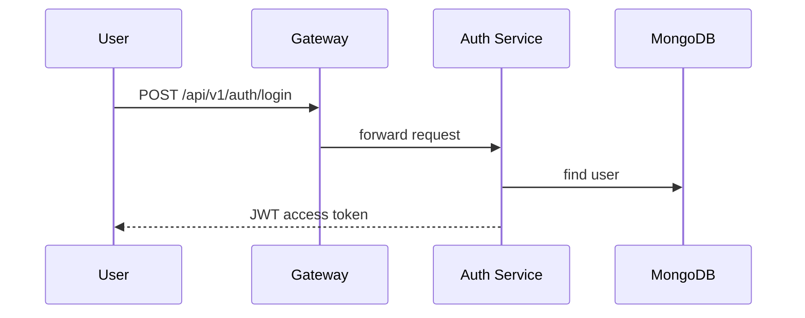

# Backend Services Architecture

## Overview
The backend is a microservices-based system using FastAPI, MongoDB, and RabbitMQ. A lightweight Nginx gateway routes all `/api/v1/*` traffic to the correct service.

## Tech Stack
- FastAPI (Python 3.11+)
- MongoDB (Motor async client)
- JWT for auth
- RabbitMQ for events and RPC
- Nginx gateway for routing

## Architecture

```mermaid
graph TD
    Client[Frontend] --> Gateway[Nginx Gateway]
    Gateway --> AuthSvc[auth-service]
    Gateway --> UserSvc[user-service]
    Gateway --> TaskSvc[task-service]

    AuthSvc --> Mongo[(MongoDB)]
    UserSvc --> Mongo
    TaskSvc --> Mongo

    AuthSvc --> MQ[(RabbitMQ)]
    UserSvc --> MQ
    TaskSvc --> MQ
```

## Services and Responsibilities

### auth-service
- Issues JWT access tokens.
- Handles registration and login.
- Publishes auth events to RabbitMQ.

### user-service
- Manages user profiles, roles, and permissions.
- Admin-only CRUD for users.
- Runs an RPC server for user lookups.

### task-service
- Manages task CRUD.
- Enforces ownership and permission checks (`read:tasks`, `write:tasks`, `delete:tasks`).
- Uses RPC calls to the user-service when needed.

### shared library
- MongoDB connection helpers.
- JWT encoding/decoding.
- Messaging helpers (publisher, subscriber, RPC client).

## Gateway Routing
- `/api/v1/auth/*` -> auth-service
- `/api/v1/users/*` -> user-service
- `/api/v1/tasks/*` -> task-service
- `/api/v1/health/*` -> health checks for each service

## Authentication Flow

```mermaid
sequenceDiagram
    participant U as User
    participant G as Gateway
    participant A as Auth Service
    participant DB as MongoDB

    U->>G: POST /api/v1/auth/login
    G->>A: forward request
    A->>DB: find user
    A-->>U: JWT access token
```

## Authorization Model
- Roles: `USER`, `ADMIN`.
- Permissions: `read:tasks`, `write:tasks`, `delete:tasks`, `manage:users`.
- Task service enforces permissions server-side.
- User service limits admin operations to admin role.

## Health Endpoints
- Gateway: `/api/v1/health`
- Auth: `/api/v1/health/auth`
- Users: `/api/v1/health/users`
- Tasks: `/api/v1/health/tasks`

## Runtime Topology (Docker)
- `auth-service` on port 8001
- `user-service` on port 8002
- `task-service` on port 8003
- `gateway` on port 8080
- `frontend` on port 5173
- `rabbitmq` on 5672 / 15672
