# Cloud Native Platform Engineering

## Learning AWS, Kubernetes & DevOps Through a Real Microservices Project

---

# Part 1: Foundation Layer

## Chapter 1 - The Journey from Application to Platform

### Goal

Understand the difference between:

* Writing software
* Running software

### Topics

* Monolith vs Distributed Systems
* Infrastructure as Code
* Platform Engineering
* DevOps Mindset
* Reliability Engineering

### Diagram

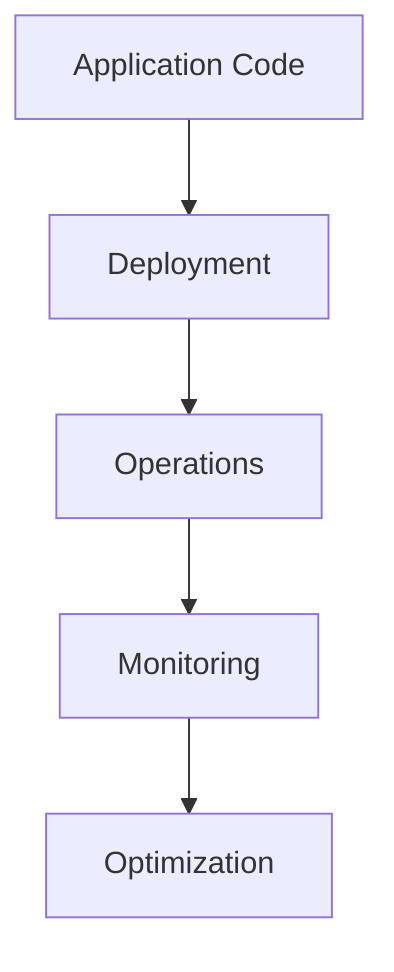

### Project Mapping

AuthDB started as:

```text
React
FastAPI
MongoDB
```

and evolved into:

```text
Frontend
Gateway
Auth Service
User Service
Task Service
MongoDB
RabbitMQ
EKS
```

---

# Chapter 2 - Networking Fundamentals

### Goal

Understand how requests travel.

### Topics

* DNS
* TCP/IP
* HTTP/HTTPS
* Reverse Proxy
* Load Balancing

### Diagram

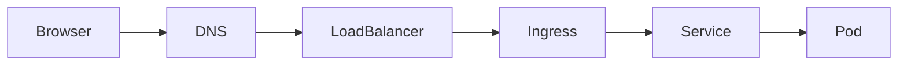

### Project Mapping

When accessing:

```text
frontend.example.com
```

Request path becomes:

```text
Browser
↓
DNS
↓
Load Balancer
↓
Ingress
↓
Gateway
↓
Service
```

---

# Part 2: AWS Foundations

## Chapter 3 - IAM

### Goal

Understand authentication and authorization.

### Topics

* Users
* Groups
* Roles
* Policies
* OIDC
* IRSA

### Diagram

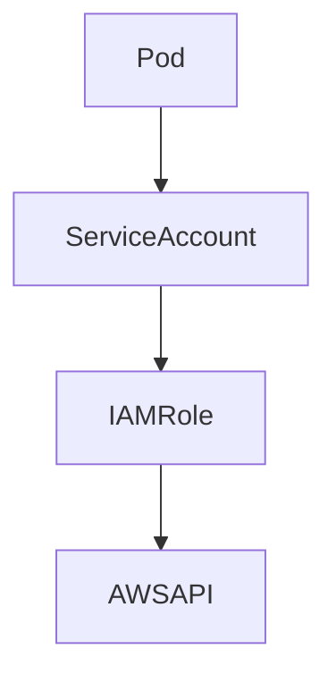

### Project Mapping

You fixed:

```text
EBS CSI Driver
↓
Missing IAM Permissions
↓
IRSA
↓
PVC Bound Successfully
```

---

# Chapter 4 - VPC

### Goal

Understand networking inside AWS.

### Topics

* CIDR
* Subnets
* Route Tables
* NAT Gateway
* Internet Gateway

### Diagram

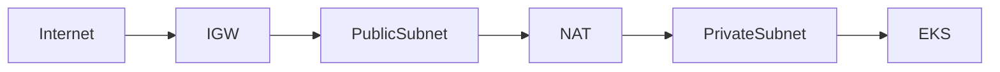

### Project Mapping

Your EKS cluster runs inside a VPC.

---

# Chapter 5 - EC2

### Goal

Understand what runs Kubernetes.

### Topics

* Instances
* AMI
* Security Groups
* Auto Scaling

### Diagram

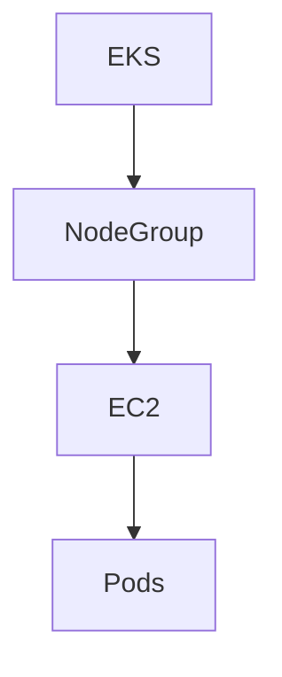

### Project Mapping

Your:

```text
m7i-flex.large
```

node hosts:

```text
MongoDB
RabbitMQ
Frontend
Gateway
Services
```

---

# Part 3: Containers

## Chapter 6 - Docker

### Topics

* Images
* Layers
* Containers
* Registries

### Diagram

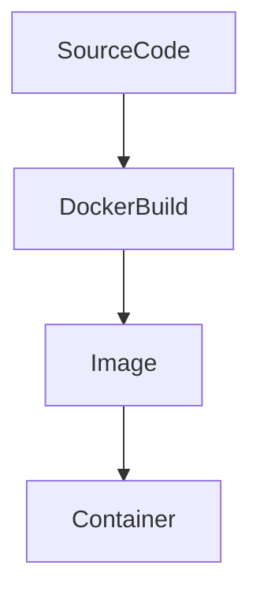

### Project Mapping

Every AuthDB service became a Docker image.

---

# Chapter 7 - ECR

### Topics

* Private Registry
* Image Storage
* Authentication

### Diagram

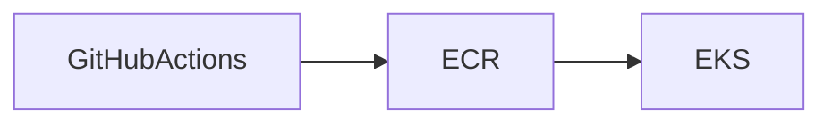

### Project Mapping

You pushed images before deployment.

---

# Part 4: Kubernetes

## Chapter 8 - Kubernetes Architecture

### Topics

* Control Plane
* Nodes
* Kubelet
* Scheduler
* API Server

### Diagram

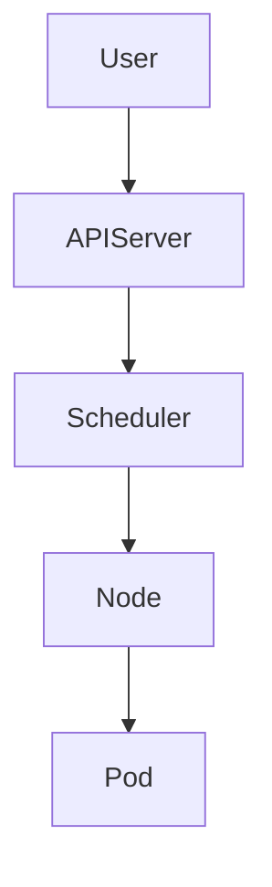

---

# Chapter 9 - Pods

### Topics

* Pod Lifecycle
* Init Containers
* Sidecars

### Diagram

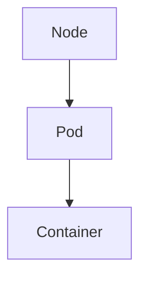

### Project Mapping

Every service runs inside Pods.

---

# Chapter 10 - Deployments

### Topics

* ReplicaSets
* Rolling Updates
* Rollbacks

### Diagram

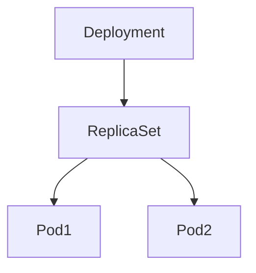

---

# Chapter 11 - Services

### Topics

* ClusterIP
* NodePort
* LoadBalancer

### Diagram

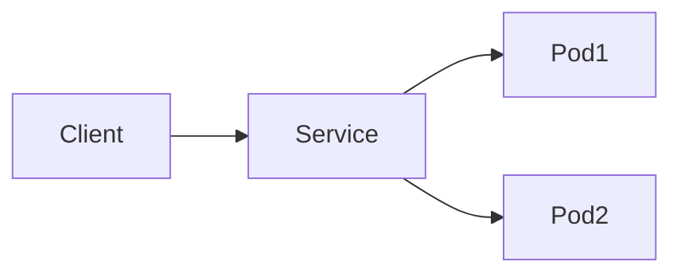

---

# Chapter 12 - Ingress

### Topics

* Routing
* Host Rules
* TLS

### Diagram

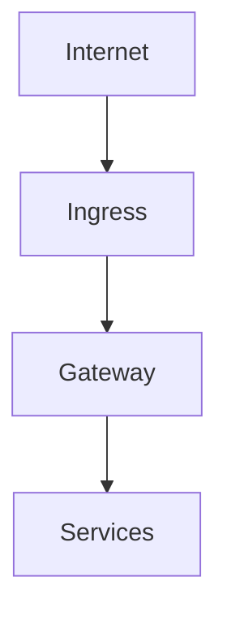

---

# Part 5: Storage

## Chapter 13 - Persistent Volumes

### Topics

* PV
* PVC
* Storage Classes

### Diagram

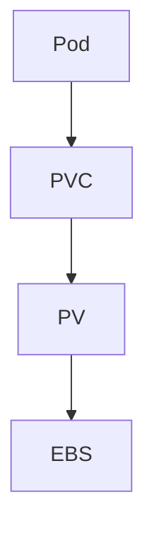

### Project Mapping

This is where you fixed:

```text
Pending PVC
StorageClass Issues
EBS CSI
```

---

# Chapter 14 - EBS CSI Driver

### Topics

* CSI Architecture
* Dynamic Provisioning
* IAM Integration

### Diagram

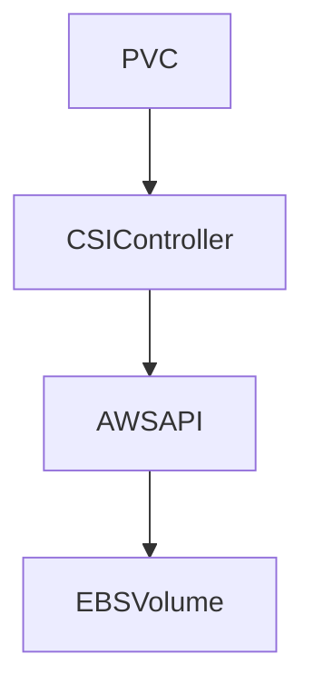

---

# Part 6: Messaging

## Chapter 15 - RabbitMQ

### Topics

* Queues
* Exchanges
* Routing Keys

### Diagram

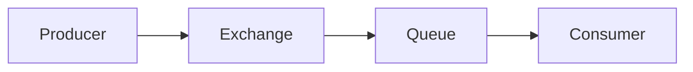

---

# Part 7: CI/CD

## Chapter 16 - GitHub Actions

### Topics

* Workflows
* Jobs
* Secrets
* Self Hosted Runners

### Diagram

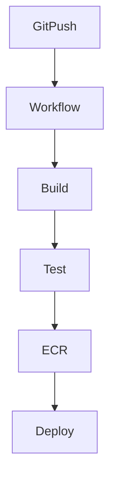

### Project Mapping

Your deployment pipeline.

---

# Part 8: Observability

## Chapter 17 - Monitoring

### Topics

* Metrics
* Logs
* Traces

### Diagram

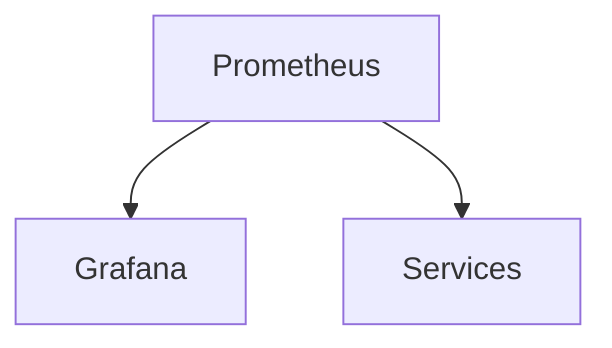

---

# Chapter 18 - Prometheus

### Topics

* Exporters
* Metrics
* ServiceMonitors

### Diagram

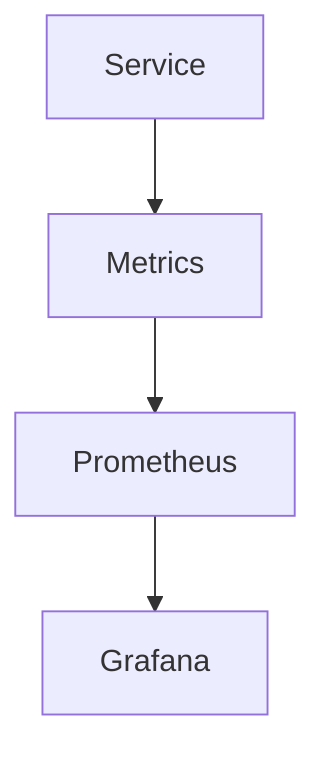

---

# Part 9: Scaling

## Chapter 19 - Horizontal Pod Autoscaler

### Diagram

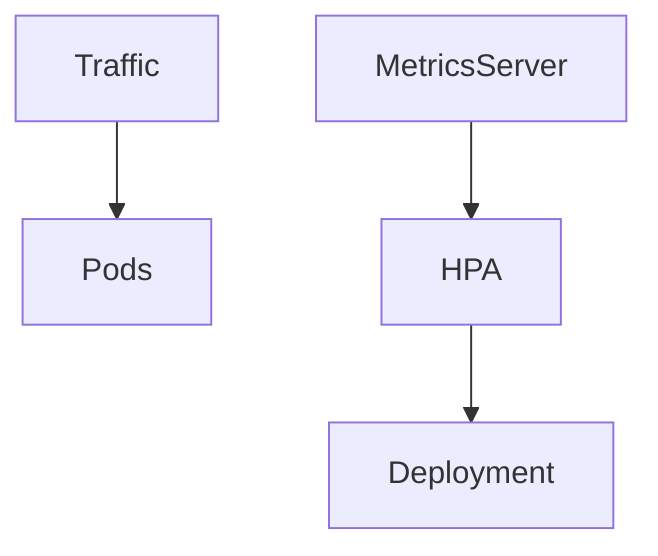

---

# Chapter 20 - Cluster Autoscaler

### Diagram

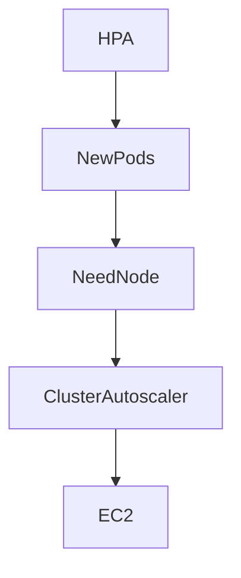

---

# Part 10: Advanced Platform Engineering

## Chapter 21 - Terraform

## Chapter 22 - GitOps

## Chapter 23 - ArgoCD

## Chapter 24 - Service Mesh

## Chapter 25 - OpenTelemetry

## Chapter 26 - Multi-Region Architecture

## Chapter 27 - Disaster Recovery

---

# Final Goal

```mermaid
flowchart TD

    Developer

    Developer --> GitHub

    GitHub --> Actions

    Actions --> ECR

    ECR --> EKS

    EKS --> Services

    Services --> MongoDB

    Services --> RabbitMQ

    Prometheus --> Grafana

    Terraform --> AWS

    ArgoCD --> EKS
```

By the end of these chapters, you'll not just know AWS services individually—you'll understand how they work together to run a real-world cloud-native platform.
