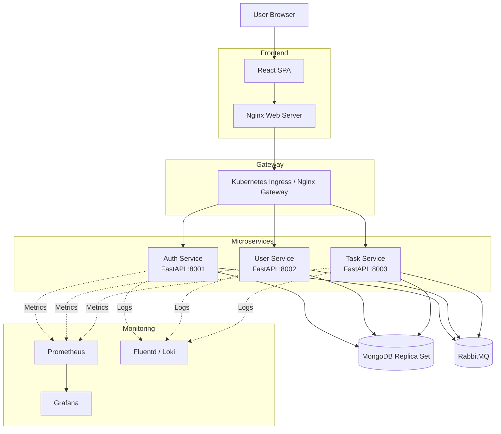
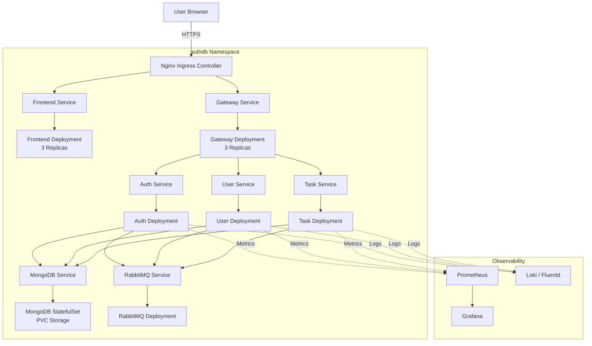
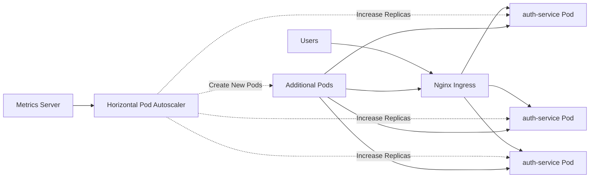
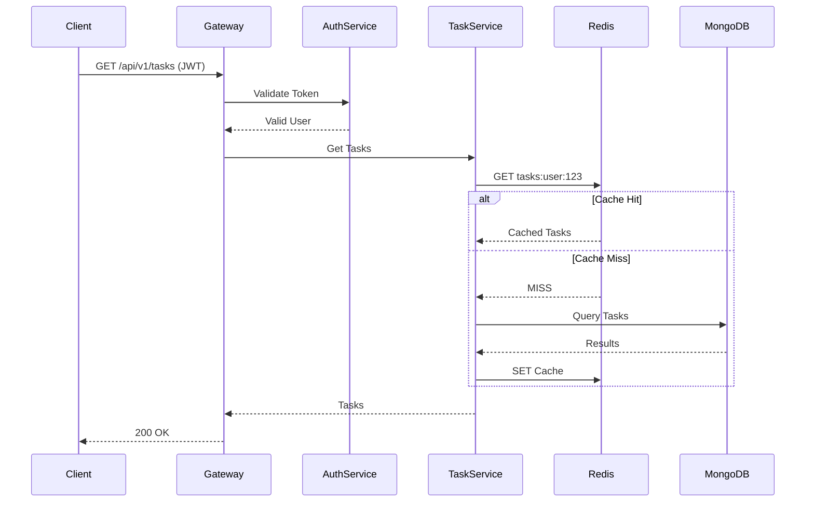
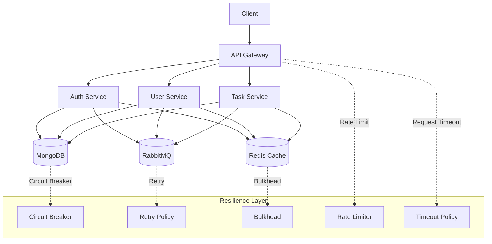
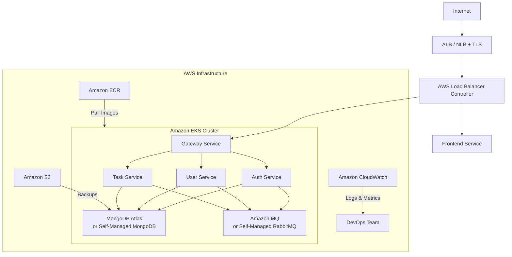

# AuthDB — Comprehensive Architecture & Scalability

This document consolidates the project architecture, Kubernetes deployment, API & microservices scalability patterns, and an AWS production topology. Diagrams are provided in Mermaid so you can paste them into docs or slide decks.

---

## 1 — System Overview (High level)

Brief: the SPA serves static assets, proxies API calls to the gateway which routes to one of three FastAPI services. Stateful components (MongoDB and RabbitMQ) are internal cluster-services.

---

## 2 — Kubernetes Architecture (cluster view)

Key points:
- Use `ClusterIP` for internal services, `LoadBalancer`/Ingress for external access.
- Keep MongoDB and RabbitMQ in private subnets/ClusterIP; do not expose them publicly.
- Use PVC for MongoDB persistence.

---

## 3 — API Scalability Patterns

1. Horizontal Pod Autoscaling

- Set CPU/memory requests & limits to enable HPA decisions.
- Use readiness probes so traffic is not sent to warming pods.

2. Caching + Read Optimization

- Use Redis (or ElastiCache on AWS) for frequent reads (task lists, user sessions). Evict/invalidate on writes.

3. Database Scaling
- Vertical scale for primary Mongo instance and use replica sets for read scaling and HA.
- On AWS use Amazon DocumentDB or a managed MongoDB Atlas cluster for production; configure replica sets and backups.

4. Message Broker and Asynchronous Work
- Offload long-running or cross-service lookups (RPC) via RabbitMQ. Use durable queues and appropriate prefetch counts.
- For very high fanout use topics/exchanges or switch to Kafka if ordering/throughput demands grow.

---

## 4 — Microservices Scalability & Resilience Patterns

- Circuit Breakers / Retry policies: implement with client libraries (HTTPX, Tenacity). Keep idempotency keys for POSTs.
- Bulkheads: limit concurrency per downstream dependency (DB / external APIs) to avoid cascading failures.
- Health checks: liveness + readiness endpoints used by K8s to manage rolling updates.
- Observability: Prometheus metrics + Grafana dashboards, structured logs shipped to ELK/CloudWatch.

---

## 5 — AWS Production Topology (EKS + ECR + Managed Services)

Recommendations for AWS:
- Use ECR for images and deploy via CI/CD (GitHub Actions or CodeBuild -> kubectl apply / Helm).
- Use EKS with managed nodegroups or Fargate for smaller services.
- Use Elastic File System or EBS for persistent storage for Mongo if self-managing.
- Consider fully managed alternatives for production: MongoDB Atlas, Amazon MQ (RabbitMQ), and Amazon ElastiCache (Redis) to minimize operational overhead.

---

## 6 — CI/CD, Release & Rollback

- Build images in CI, tag with semver/sha, push to ECR.
- Use `kubectl` or `helm` for declarative deploys; keep manifests versioned and templatized.
- Use `kubectl rollout undo` for quick rollbacks; use readiness probes to prevent bad releases.

---

## 7 — Quick Troubleshooting Checklist

- `kubectl get pods -n authdb` — check pod states
- `kubectl logs -n authdb deployment/auth-service` — service logs
- `kubectl port-forward svc/gateway 8080:80 -n authdb` — debug API routing
- Check `rabbitmq` and `mongodb` pod logs for connectivity issues

---

## Files in repo referenced
- `k8s/*.yml`, `services/*/Dockerfile`, `frontend/Dockerfile`, `gateway/nginx.conf`, `docker-compose.yml`

---

AuthDB — architecture summary generated from repository docs and manifests. Use sections or diagrams in presentations as-is (Mermaid native).
