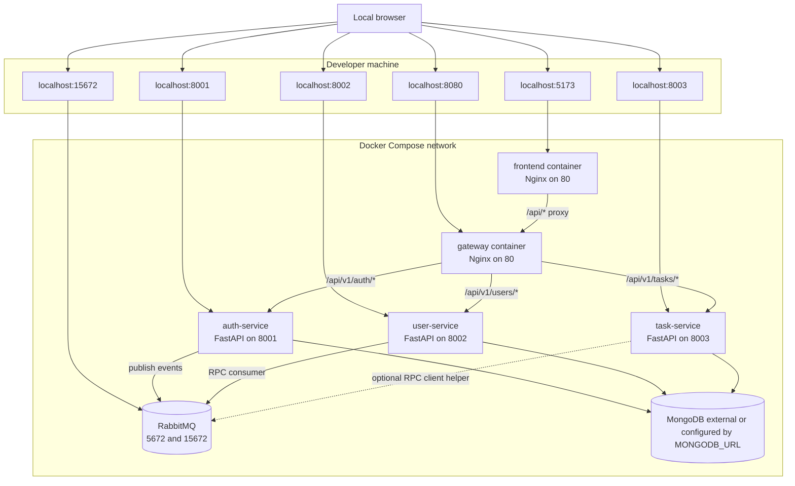
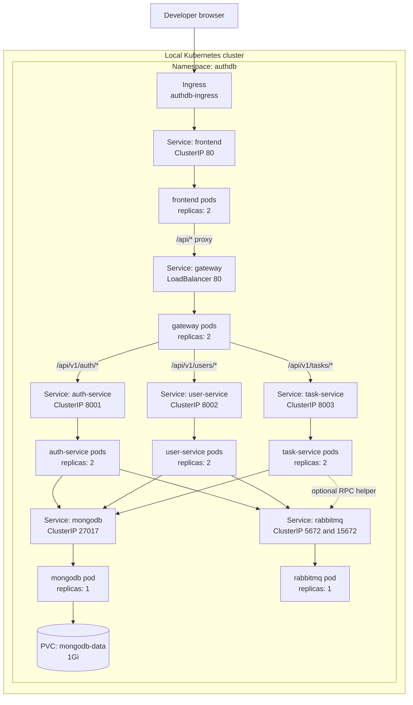
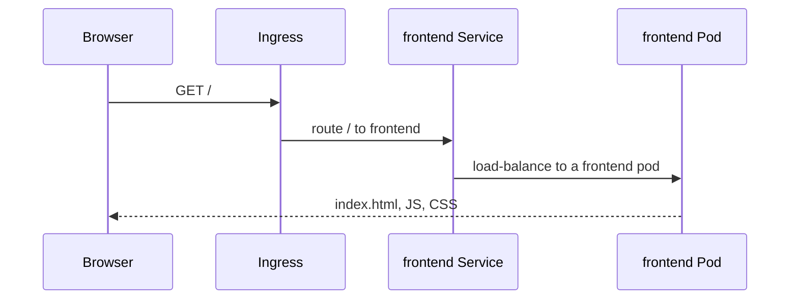
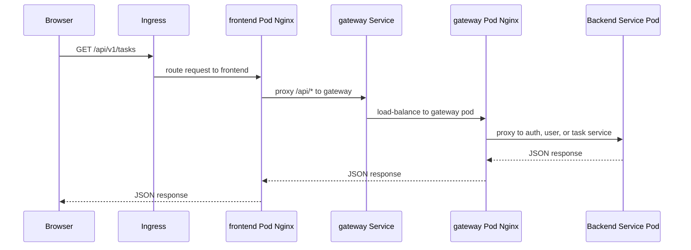
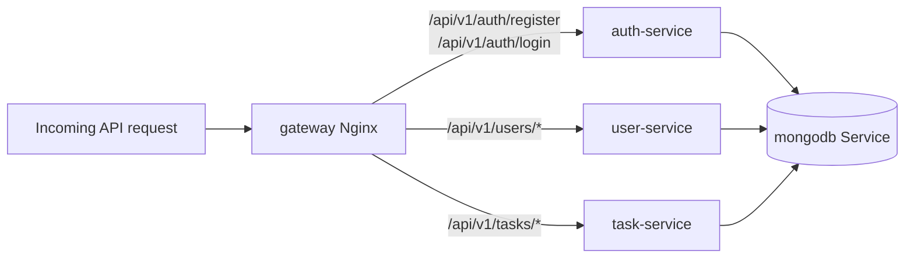
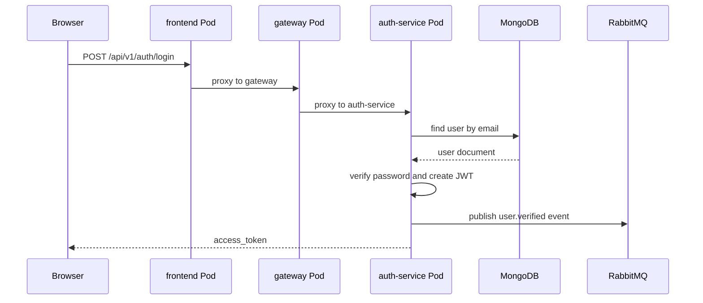
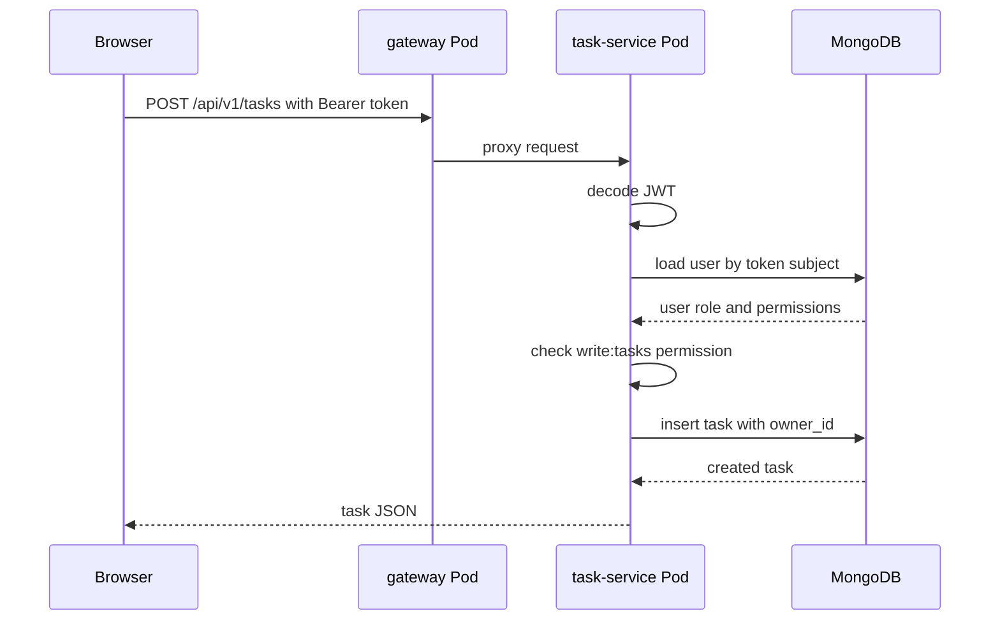
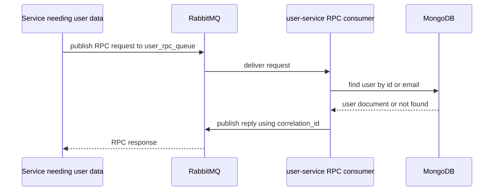
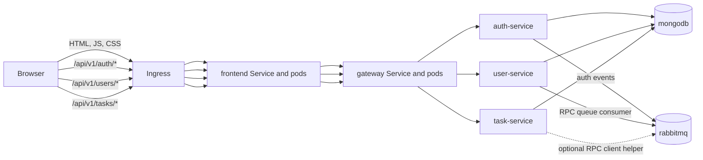

# Containerization and Kubernetes Architecture

## Purpose

This document explains how AuthDB is containerized, how the local Docker Compose setup works, and how the Kubernetes resources communicate with each other when deployed locally.

The project is split into these runtime services:

| Service | Runtime | Container image | Internal port | Main responsibility |
| --- | --- | --- | --- | --- |
| frontend | React build served by Nginx | `authdb-frontend:latest` | `80` | Serves the SPA and proxies browser `/api/` calls to the gateway |
| gateway | Nginx | `nginx:1.27-alpine` | `80` | Routes API paths to backend services |
| auth-service | FastAPI + Uvicorn | `authdb-auth-service:latest` | `8001` | Registration, login, JWT creation, auth events |
| user-service | FastAPI + Uvicorn | `authdb-user-service:latest` | `8002` | User CRUD, admin access, RabbitMQ RPC server |
| task-service | FastAPI + Uvicorn | `authdb-task-service:latest` | `8003` | Task CRUD and permission checks |
| mongodb | MongoDB | `mongo:7` | `27017` | Stores users and tasks |
| rabbitmq | RabbitMQ with management UI | `rabbitmq:3-management` | `5672`, `15672` | Async events and RPC queue transport |

## How Containerization Works

Each application service is packaged into its own container image.

### Backend service images

The three Python services use the same pattern:

1. Start from `python:3.11-slim`.
2. Set `/app` as the working directory.
3. Install system build dependencies needed by Python packages.
4. Copy the service-specific `requirements.txt`.
5. Copy the shared package from `shared/`.
6. Copy the service app from `services/<service>/app`.
7. Install Python dependencies.
8. Expose the service port.
9. Run Uvicorn with `app.main:app`.

Because the Dockerfiles copy both `shared/` and the service folder, the image build context must be the repository root.

Example:

```bash
docker build -f services/auth-services/Dockerfile -t authdb-auth-service:latest .
docker build -f services/user-services/Dockerfile -t authdb-user-service:latest .
docker build -f services/tasks-services/Dockerfile -t authdb-task-service:latest .
```

### Frontend image

The frontend image uses a two-stage build:

1. `node:22-alpine` installs npm dependencies and runs `npm run build`.
2. `nginx:1.27-alpine` serves the static files from `/usr/share/nginx/html`.
3. `frontend/nginx.conf` proxies `/api/` requests to `http://gateway/api/`.

Build command:

```bash
docker build -f frontend/Dockerfile -t authdb-frontend:latest .
```

### Gateway container

The gateway is an Nginx container. In Docker Compose it mounts `gateway/nginx.conf` from the host. In Kubernetes it uses the stock `nginx:1.27-alpine` image and mounts the gateway config from the `gateway-nginx-config` ConfigMap.

The gateway routes:

| Incoming path | Upstream service |
| --- | --- |
| `/api/v1/auth` and `/api/v1/auth/*` | `auth-service:8001` |
| `/api/v1/users` and `/api/v1/users/*` | `user-service:8002` |
| `/api/v1/tasks` and `/api/v1/tasks/*` | `task-service:8003` |
| `/api/v1/health/auth` | `auth-service:8001/api/v1/health` |
| `/api/v1/health/users` | `user-service:8002/api/v1/health` |
| `/api/v1/health/tasks` | `task-service:8003/api/v1/health` |

## Local Docker Compose Architecture

Docker Compose creates one default network for the stack. Containers find each other by service name through Docker DNS.



Important Compose note: `docker-compose.yml` does not start a MongoDB container. It expects `MONGODB_URL` from `.env` or another external MongoDB connection. If `.env` is missing, the default value `mongodb://mongodb:27017` points to a Compose service that is not currently defined.

Run locally with Compose:

```bash
docker compose up --build
```

Useful local URLs:

| URL | Target |
| --- | --- |
| `http://localhost:5173` | Frontend |
| `http://localhost:8080/api/v1/health` | Gateway health |
| `http://localhost:8001/api/v1/health` | Auth service health |
| `http://localhost:8002/api/v1/health` | User service health |
| `http://localhost:8003/api/v1/health` | Task service health |
| `http://localhost:15672` | RabbitMQ management UI |

## Kubernetes Resource Architecture

All Kubernetes resources run in the `authdb` namespace.

| Resource type | Files | Purpose |
| --- | --- | --- |
| Namespace | `k8s/namespace.yml` | Isolates all project resources under `authdb` |
| Secrets | `k8s/secret.yml` | JWT secret, MongoDB credentials, RabbitMQ credentials |
| ConfigMaps | `k8s/configmap.yml` | Shared app config and gateway Nginx config |
| Deployments | `k8s/*-deployment.yml`, `k8s/mongodb-persistent-volume.yml` | Run pods for frontend, gateway, services, MongoDB, RabbitMQ |
| Services | `k8s/service.yml` | Stable DNS names and load balancing for pods |
| PVC | `k8s/mongodb-persistent-volume.yml` | Persistent MongoDB data storage |
| Ingress | `k8s/ingress.yml` | Local HTTP entrypoint to the frontend service |
| HPA | `k8s/hpa.yml` | CPU-based autoscaling for frontend and backend API services |

### Kubernetes deployment view



### Kubernetes DNS and service discovery

Pods do not call other pods directly. They call Kubernetes Services. A Service gives a stable DNS name and load balances traffic to matching pods.

Inside the `authdb` namespace, short names work:

```text
frontend
gateway
auth-service
user-service
task-service
mongodb
rabbitmq
```

Fully qualified names also work:

```text
auth-service.authdb.svc.cluster.local
user-service.authdb.svc.cluster.local
task-service.authdb.svc.cluster.local
mongodb.authdb.svc.cluster.local
rabbitmq.authdb.svc.cluster.local
```

The gateway Nginx config uses the short service names:

```text
auth-service:8001
user-service:8002
task-service:8003
```

Application containers use:

```text
MONGODB_URL=mongodb://<user>:<password>@mongodb:27017/<db>?authSource=admin
RABBITMQ_URL=amqp://<user>:<password>@rabbitmq:5672/
```

## Step-by-Step Kubernetes Communication

### 1. Browser loads the frontend



The current `k8s/ingress.yml` sends all `/` traffic to the `frontend` Service. The frontend pod serves the React SPA through Nginx.

### 2. Browser calls an API endpoint



The frontend Nginx config is part of the frontend image. It proxies `/api/` to `http://gateway/api/`, so API calls move from frontend pod to gateway Service, then to the correct backend Service.

### 3. Gateway chooses the backend service



The gateway is the internal API router. The frontend does not need to know backend pod addresses or ports.

### 4. Login and JWT flow



The browser stores the returned JWT and sends it on later requests:

```http
Authorization: Bearer <token>
```

### 5. Task API flow



The task service currently validates the user by reading from MongoDB directly. The codebase also contains an RPC client helper for user lookup, but the current task routes do not call it.

### 6. User service RPC and RabbitMQ flow

The user service starts an RPC consumer on startup. It listens on the queue named by `USER_RPC_QUEUE`, which defaults to `user_rpc_queue`.



Implemented RPC actions:

| Action | Input | Response |
| --- | --- | --- |
| `get_user_by_id` | `user_id` | `{ "user": ... }` or `{ "error": ... }` |
| `validate_user` | `email` | `{ "valid": true/false }` |

Auth events are separate from RPC. The auth service publishes topic events to the `auth_events` exchange:

| Event routing key | When it is published |
| --- | --- |
| `user.created` | After registration succeeds |
| `user.verified` | After login succeeds |

## Local Kubernetes Deployment Steps

### 1. Start minikube

```bash
minikube start
minikube addons enable ingress
minikube addons enable metrics-server
```

### 2. Build images inside minikube

Point Docker to the minikube Docker daemon:

```bash
eval $(minikube docker-env)
```

Build the images expected by the manifests:

```bash
docker build -f services/auth-services/Dockerfile -t authdb-auth-service:latest .
docker build -f services/user-services/Dockerfile -t authdb-user-service:latest .
docker build -f services/tasks-services/Dockerfile -t authdb-task-service:latest .
docker build -f frontend/Dockerfile -t authdb-frontend:latest .
```

The gateway deployment uses `nginx:1.27-alpine` and the `gateway-nginx-config` ConfigMap, so a custom gateway image is not required for the current Kubernetes manifests.

### 3. Apply Kubernetes manifests

Apply shared resources first, then stateful dependencies, then application workloads, then networking and autoscaling:

```bash
kubectl apply -f k8s/namespace.yml
kubectl apply -f k8s/secret.yml
kubectl apply -f k8s/configmap.yml
kubectl apply -f k8s/mongodb-persistent-volume.yml
kubectl apply -f k8s/rabbitmq-deployment.yml
kubectl apply -f k8s/auth-service-deployment.yml
kubectl apply -f k8s/user-service-deployment.yml
kubectl apply -f k8s/task-service-deployment.yml
kubectl apply -f k8s/gateway-deployment.yml
kubectl apply -f k8s/frontend-deployment.yml
kubectl apply -f k8s/service.yml
kubectl apply -f k8s/ingress.yml
kubectl apply -f k8s/hpa.yml
```

### 4. Verify workloads

```bash
kubectl get pods -n authdb
kubectl get svc -n authdb
kubectl get ingress -n authdb
kubectl get hpa -n authdb
```

Check that Services have endpoints:

```bash
kubectl get endpoints -n authdb
```

### 5. Access locally

Option A: use port-forwarding.

```bash
kubectl -n authdb port-forward service/frontend 5173:80
kubectl -n authdb port-forward service/gateway 8080:80
```

Then open:

| URL | Target |
| --- | --- |
| `http://localhost:5173` | Frontend through Kubernetes |
| `http://localhost:8080/api/v1/health` | Gateway health through Kubernetes |

Option B: use minikube ingress.

```bash
minikube ip
```

Map the minikube IP to a local host name if desired:

```text
<minikube-ip> authdb.local
```

Then open:

```text
http://authdb.local
```

Option C: expose the LoadBalancer service with minikube tunnel.

```bash
minikube tunnel
kubectl get svc gateway -n authdb
```

Use the external IP shown for the `gateway` Service to call the API directly.

## Operational Behavior

### Readiness and liveness probes

Backend services expose:

```text
/api/v1/health
```

Kubernetes uses this endpoint for readiness and liveness checks. A backend pod is only considered ready when it can respond successfully. The health route checks MongoDB connectivity, so backend readiness depends on MongoDB being reachable.

MongoDB and RabbitMQ use command-based probes:

| Service | Probe command |
| --- | --- |
| MongoDB | `mongosh --quiet --eval db.adminCommand("ping")` |
| RabbitMQ | `rabbitmq-diagnostics ping` |

### Scaling

The application Deployments start with two replicas:

| Deployment | Initial replicas | HPA range |
| --- | --- | --- |
| frontend | 2 | 2 to 5 |
| gateway | 2 | No HPA currently defined |
| auth-service | 2 | 2 to 5 |
| user-service | 2 | 2 to 5 |
| task-service | 2 | 2 to 5 |
| mongodb | 1 | No HPA |
| rabbitmq | 1 | No HPA |

The HPA targets CPU utilization at 70 percent for frontend, auth-service, user-service, and task-service.

### Configuration and secrets

`authdb-config` provides non-secret configuration:

```text
DB_NAME=auth_scaleDB
USER_RPC_QUEUE=user_rpc_queue
ALGORITHM=HS256
ACCESS_TOKEN_EXPIRE_MINUTES=30
```

`authdb-secret` provides sensitive values:

```text
SECRET_KEY
RABBITMQ_DEFAULT_USER
RABBITMQ_DEFAULT_PASS
MONGODB_ROOT_USER
MONGODB_ROOT_PASSWORD
MONGODB_DB
```

For production, replace the sample secret values before deploying.

## End-to-End Request Summary



In short:

1. The browser talks to the frontend.
2. The frontend serves the SPA and forwards `/api/` traffic to the gateway.
3. The gateway routes each API path to the correct backend service.
4. Backend services use MongoDB for persistent data.
5. RabbitMQ supports async auth events and the user-service RPC queue.
6. Kubernetes Services provide stable DNS names and load balancing between pods.
