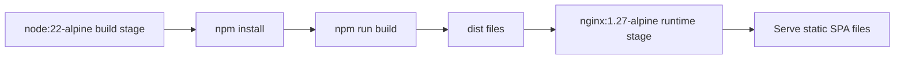
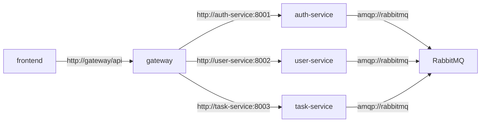
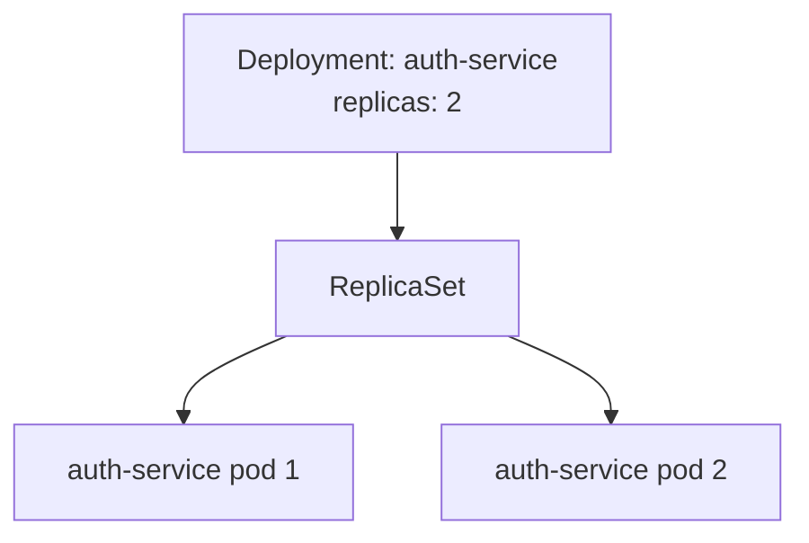
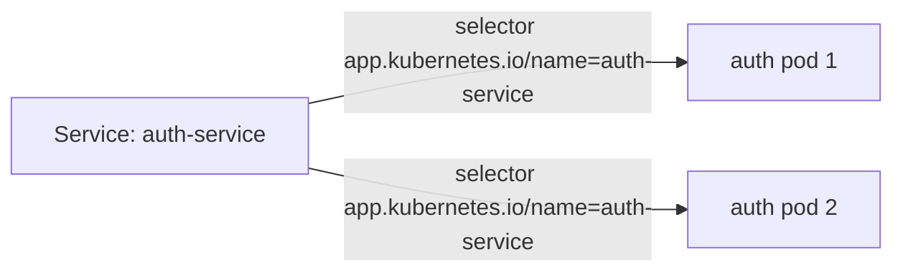
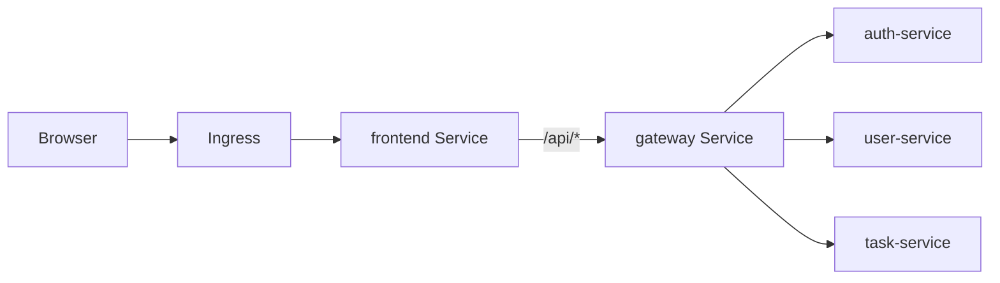
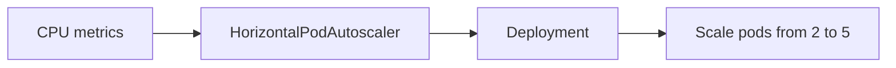
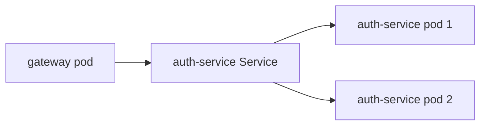
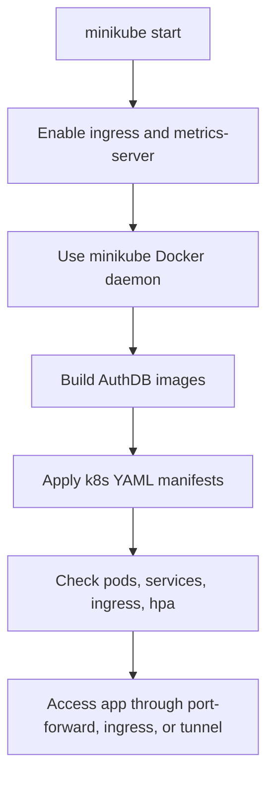
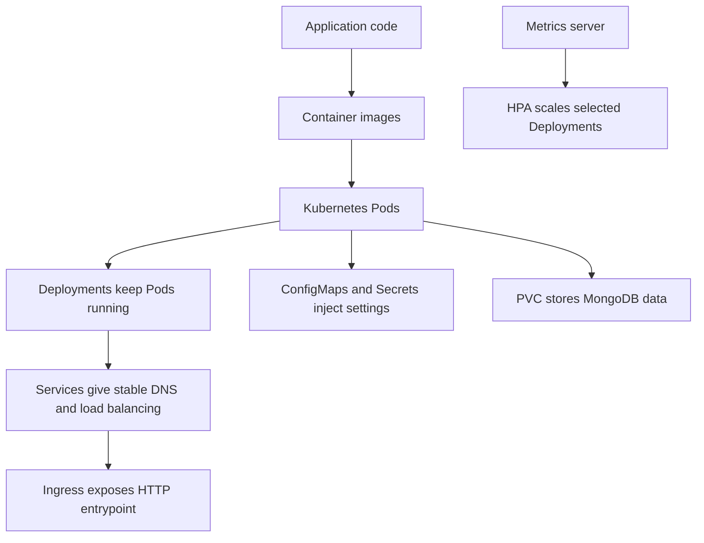

# Containerization and Kubernetes Fundamentals Used in AuthDB

## Purpose

This document explains the fundamental containerization and Kubernetes concepts used by this project. It is written around the actual AuthDB services and manifests, so each concept is connected to where it appears in the repository.

Use this document together with:

- `docs/Containerization_Kubernetes_Architecture.md` for service communication diagrams.
- `docs/Deployment_Plan.md` for local deployment steps.
- `k8s/` for the actual Kubernetes manifests.

## 1. Containerization

Containerization means packaging an application with everything it needs to run: runtime, dependencies, code, configuration defaults, and startup command.

In this project, these services are containerized:

| Service | Dockerfile or image | What runs inside |
| --- | --- | --- |
| frontend | `frontend/Dockerfile` | Nginx serving the React build |
| auth-service | `services/auth-services/Dockerfile` | FastAPI app on Uvicorn |
| user-service | `services/user-services/Dockerfile` | FastAPI app on Uvicorn |
| task-service | `services/tasks-services/Dockerfile` | FastAPI app on Uvicorn |
| gateway | `nginx:1.27-alpine` | Nginx reverse proxy |
| mongodb | `mongo:7` | MongoDB database |
| rabbitmq | `rabbitmq:3-management` | RabbitMQ broker and management UI |

### Image vs container

An image is the packaged template. A container is a running instance of that image.

Example from this project:

```text
Image:     authdb-auth-service:latest
Container: one running auth-service process created from that image
```

In Kubernetes, containers run inside Pods. In Docker Compose, containers run directly as Compose services.

### Dockerfile

A Dockerfile describes how to build an image.

The backend Dockerfiles use this pattern:

```mermaid
flowchart LR
    Base[python:3.11-slim] --> Workdir[WORKDIR /app]
    Workdir --> SystemDeps[Install build dependencies]
    SystemDeps --> Requirements[Copy requirements.txt]
    Requirements --> Shared[Copy shared package]
    Shared --> App[Copy service app]
    App --> Pip[Install Python packages]
    Pip --> Expose[Expose service port]
    Expose --> Cmd[Run uvicorn app.main:app]
```



Why this matters:

1. Each backend service runs independently.
2. The same shared code can be copied into each service image.
3. The container exposes one clear internal HTTP port.
4. Kubernetes can start, stop, scale, and replace each service container separately.

### Build context

The backend Dockerfiles copy both `shared/` and a service folder. Because of that, the build context must be the repository root:

```bash
docker build -f services/auth-services/Dockerfile -t authdb-auth-service:latest .
```

The final `.` is important because it gives Docker access to both:

```text
shared/
services/auth-services/
```

### Multi-stage build

The frontend uses a multi-stage Docker build:



Why this matters:

1. Node.js is only needed to build the React app.
2. The final container only needs Nginx and static files.
3. The runtime image is smaller and simpler.

## 2. Docker Compose Concepts Used Locally

Docker Compose is used for local multi-container development.

The project defines services in `docker-compose.yml`:

```text
rabbitmq
auth-service
user-service
task-service
gateway
frontend
```

### Compose service

A Compose service describes one container type. For example, `auth-service` says:

- Build from `services/auth-services/Dockerfile`.
- Run on internal port `8001`.
- Publish host port `8001` by default.
- Receive environment variables like `MONGODB_URL` and `RABBITMQ_URL`.
- Start after RabbitMQ.

### Compose network and DNS

Compose creates a private network for the stack. Containers communicate using service names as DNS names.



The gateway can call `auth-service:8001` because `auth-service` is the Compose service name.

### Port publishing

Port publishing maps a container port to a local machine port.

Example:

```yaml
ports:
  - "8001:8001"
```

That means:

```text
localhost:8001 -> auth-service container port 8001
```

### Environment variables

The services use environment variables to avoid hardcoding runtime settings.

Examples:

```text
MONGODB_URL
DB_NAME
RABBITMQ_URL
USER_RPC_QUEUE
```

Important local note: the Compose file does not start a MongoDB container. It expects `MONGODB_URL` from `.env` or another external MongoDB connection.

## 3. Kubernetes Concepts Used

Kubernetes is used to run the same project in a cluster-like local environment.

The Kubernetes manifests are in `k8s/`.

### Namespace

A Namespace groups related Kubernetes resources.

AuthDB uses:

```text
namespace: authdb
```

Defined in:

```text
k8s/namespace.yml
```

Why it is used:

1. Keeps AuthDB resources separate from other cluster resources.
2. Makes commands easier:

```bash
kubectl get pods -n authdb
```

### Pod

A Pod is the smallest deployable unit in Kubernetes. A Pod usually wraps one application container.

In this project:

```text
auth-service pod -> auth-service container
user-service pod -> user-service container
task-service pod -> task-service container
frontend pod -> frontend container
gateway pod -> nginx gateway container
mongodb pod -> mongodb container
rabbitmq pod -> rabbitmq container
```

Pods are temporary. Kubernetes can delete and recreate them at any time.

### Deployment

A Deployment manages Pods and keeps the requested number of replicas running. Deployments are most commonly used for stateless application workloads. In this local project, they are also used for MongoDB and RabbitMQ to keep the manifests simple.

AuthDB uses Deployments for:

```text
frontend
gateway
auth-service
user-service
task-service
rabbitmq
mongodb
```

Example behavior:



Why it is used:

1. Keeps the required number of Pods running.
2. Replaces crashed Pods automatically.
3. Supports rolling updates.
4. Allows horizontal scaling.

### Replica

A replica is one copy of a Pod managed by a Deployment.

The application services use two replicas:

```text
frontend: 2
gateway: 2
auth-service: 2
user-service: 2
task-service: 2
```

This helps availability. If one Pod is restarting, another can still serve traffic.

### Labels and selectors

Labels are key-value metadata attached to resources. Selectors use labels to connect resources together.

Example pattern used in the manifests:

```yaml
labels:
  app.kubernetes.io/name: auth-service
```

The `auth-service` Service selects Pods with the same label:

```yaml
selector:
  app.kubernetes.io/name: auth-service
```

Why this matters:



The Service does not need to know Pod names. It only needs labels.

### Service

A Kubernetes Service gives Pods a stable network name and load balances traffic to them.

AuthDB Services are defined in:

```text
k8s/service.yml
```

| Service | Type | Port | Purpose |
| --- | --- | --- | --- |
| frontend | ClusterIP | `80` | Internal access to frontend Pods |
| gateway | LoadBalancer | `80` | External/local API gateway access |
| auth-service | ClusterIP | `8001` | Internal access to auth Pods |
| user-service | ClusterIP | `8002` | Internal access to user Pods |
| task-service | ClusterIP | `8003` | Internal access to task Pods |
| mongodb | ClusterIP | `27017` | Internal database access |
| rabbitmq | ClusterIP | `5672`, `15672` | Internal broker and management access |

### ClusterIP

`ClusterIP` exposes a service only inside the Kubernetes cluster.

Used for:

```text
frontend
auth-service
user-service
task-service
mongodb
rabbitmq
```

Backend services should not be directly exposed outside the cluster. The gateway routes traffic to them.

### LoadBalancer

`LoadBalancer` exposes a service outside the cluster when the local Kubernetes environment supports it.

Used for:

```text
gateway
```

In minikube, `LoadBalancer` normally needs:

```bash
minikube tunnel
```

### Kubernetes DNS

Kubernetes automatically creates DNS names for Services.

Inside the `authdb` namespace, services can use short names:

```text
gateway
auth-service
user-service
task-service
mongodb
rabbitmq
```

Examples:

```text
http://auth-service:8001
mongodb://mongodb:27017
amqp://rabbitmq:5672
```

This is why Pods do not need hardcoded IP addresses.

### ConfigMap

A ConfigMap stores non-secret configuration.

AuthDB uses `authdb-config` in:

```text
k8s/configmap.yml
```

It stores values such as:

```text
DB_NAME
MONGODB_URL
USER_RPC_QUEUE
ALGORITHM
ACCESS_TOKEN_EXPIRE_MINUTES
```

It also stores the gateway Nginx configuration in:

```text
gateway-nginx-config
```

Why it is used:

1. Keeps configuration outside the container image.
2. Allows different config per environment.
3. Allows the same image to run locally, in staging, or in production with different settings.

### Secret

A Secret stores sensitive values.

AuthDB uses:

```text
k8s/secret.yml
```

It contains:

```text
SECRET_KEY
RABBITMQ_DEFAULT_USER
RABBITMQ_DEFAULT_PASS
MONGODB_ROOT_USER
MONGODB_ROOT_PASSWORD
MONGODB_DB
```

Why it is used:

1. Keeps credentials out of Docker images.
2. Separates sensitive config from normal config.
3. Allows Pods to receive secrets as environment variables.

The current values are development examples. Replace them before production deployment.

### Environment injection

Deployments inject ConfigMap and Secret values into containers.

The backend Deployments use:

```yaml
envFrom:
  - configMapRef:
      name: authdb-config
```

And individual secret-backed variables:

```yaml
env:
  - name: SECRET_KEY
    valueFrom:
      secretKeyRef:
        name: authdb-secret
        key: SECRET_KEY
```

This gives the app everything it needs at runtime without rebuilding the image.

### Ingress

Ingress routes HTTP traffic from outside the cluster to a Service inside the cluster.

AuthDB uses:

```text
k8s/ingress.yml
```

Current routing:

```text
/ -> frontend Service
```

The frontend Nginx then proxies `/api/` requests to the gateway Service.



Why it is used:

1. Gives a single HTTP entrypoint for the web app.
2. Keeps backend services private.
3. Allows local hostnames such as `authdb.local` when configured with minikube ingress.

### PersistentVolumeClaim

A PersistentVolumeClaim asks Kubernetes for durable storage.

MongoDB uses:

```text
PVC: mongodb-data
size: 1Gi
mount path: /data/db
```

Defined in:

```text
k8s/mongodb-persistent-volume.yml
```

Why it is used:

1. MongoDB data must survive Pod restarts.
2. Pods are temporary, but database data should be persistent.
3. The PVC separates storage lifecycle from Pod lifecycle.

### Volumes and volume mounts

A volume makes external data available inside a Pod.

AuthDB uses volumes for:

| Use case | Mounted into |
| --- | --- |
| MongoDB data PVC | MongoDB container at `/data/db` |
| Gateway Nginx config ConfigMap | Gateway container at `/etc/nginx/nginx.conf` |

### Readiness probe

A readiness probe tells Kubernetes when a container is ready to receive traffic.

Backend services use:

```text
GET /api/v1/health
```

If a Pod is not ready, the Service will not send traffic to it.

### Liveness probe

A liveness probe tells Kubernetes whether a container is still healthy.

If the liveness probe fails repeatedly, Kubernetes restarts the container.

AuthDB uses liveness probes for:

```text
frontend
gateway
auth-service
user-service
task-service
mongodb
rabbitmq
```

### Resource requests and limits

Resource requests tell Kubernetes the minimum CPU and memory a container expects.

Resource limits cap how much CPU and memory a container can use.

Examples from the manifests:

| Workload | CPU request | Memory request | CPU limit | Memory limit |
| --- | --- | --- | --- | --- |
| frontend | `50m` | `64Mi` | `250m` | `128Mi` |
| gateway | `50m` | `64Mi` | `250m` | `128Mi` |
| backend services | `100m` | `128Mi` | `500m` | `512Mi` |

Why they are used:

1. Helps Kubernetes schedule Pods.
2. Prevents one container from consuming too many resources.
3. Gives HPA CPU data a useful baseline.

### HorizontalPodAutoscaler

An HPA automatically changes replica counts based on metrics.

Defined in:

```text
k8s/hpa.yml
```

AuthDB uses HPA for:

```text
frontend
auth-service
user-service
task-service
```

Current behavior:

```text
minReplicas: 2
maxReplicas: 5
target CPU utilization: 70%
```



The metrics server must be enabled in minikube:

```bash
minikube addons enable metrics-server
```

### imagePullPolicy

The application Deployments use:

```yaml
imagePullPolicy: IfNotPresent
```

This means Kubernetes uses a local image if it already exists on the node. This is useful for minikube when images are built inside the minikube Docker daemon.

## 4. Application Communication Concepts

### Reverse proxy

A reverse proxy receives client requests and forwards them to internal services.

AuthDB has two reverse proxy layers:

1. Frontend Nginx proxies `/api/` to the gateway.
2. Gateway Nginx proxies `/api/v1/auth/*`, `/api/v1/users/*`, and `/api/v1/tasks/*` to backend services.

### API gateway pattern

The gateway centralizes backend routing.

The browser does not need to know:

```text
auth-service:8001
user-service:8002
task-service:8003
```

It only calls:

```text
/api/v1/...
```

### Service discovery

Service discovery means finding other services without hardcoded IP addresses.

AuthDB uses:

| Environment | Service discovery mechanism |
| --- | --- |
| Docker Compose | Compose service names |
| Kubernetes | Kubernetes Service DNS |

### Load balancing

When a Service points to multiple Pods, Kubernetes spreads traffic between them.

Example:



The caller uses `auth-service:8001`; Kubernetes chooses a ready Pod.

### Synchronous communication

Synchronous communication means the caller waits for a response.

Used for:

```text
frontend -> gateway
gateway -> auth-service
gateway -> user-service
gateway -> task-service
backend services -> MongoDB
```

### Asynchronous messaging

Asynchronous messaging means a service publishes a message and does not need a direct HTTP response from another service.

AuthDB uses RabbitMQ for auth events:

```text
auth-service -> RabbitMQ exchange auth_events
```

Published events:

```text
user.created
user.verified
```

### RPC over RabbitMQ

RPC means request and response messaging over a queue.

The user service starts a consumer on:

```text
user_rpc_queue
```

It supports:

```text
get_user_by_id
validate_user
```

The codebase includes a task-service RPC helper, but the current task routes validate users directly through MongoDB.

## 5. Stateless and Stateful Workloads

### Stateless services

Stateless services can be replaced without losing data because their state is stored somewhere else.

Mostly stateless in this project:

```text
frontend
gateway
auth-service
user-service
task-service
```

These can run multiple replicas more easily.

RabbitMQ is a broker and can hold queue state. In this project it runs as a single local Deployment without a persistent volume, which is fine for local development but not the pattern to use for durable production messaging.

### Stateful services

Stateful services need persistent data.

Stateful in this project:

```text
mongodb
```

MongoDB uses a PVC so user and task data can survive Pod restarts.

## 6. Local Kubernetes Deployment Model

For local Kubernetes, the project is designed around minikube.

The normal local flow is:



The key local Kubernetes idea:

```text
Build images where the cluster can see them.
```

With minikube, that usually means:

```bash
eval $(minikube docker-env)
```

Then build images using the names from the manifests:

```bash
docker build -f services/auth-services/Dockerfile -t authdb-auth-service:latest .
docker build -f services/user-services/Dockerfile -t authdb-user-service:latest .
docker build -f services/tasks-services/Dockerfile -t authdb-task-service:latest .
docker build -f frontend/Dockerfile -t authdb-frontend:latest .
```

## 7. Concept-to-File Mapping

| Concept | Project file |
| --- | --- |
| Container image build | `frontend/Dockerfile`, `services/*/Dockerfile` |
| Local multi-container run | `docker-compose.yml` |
| Namespace | `k8s/namespace.yml` |
| ConfigMap | `k8s/configmap.yml` |
| Secret | `k8s/secret.yml` |
| Deployments | `k8s/*-deployment.yml`, `k8s/mongodb-persistent-volume.yml` |
| Services | `k8s/service.yml` |
| Ingress | `k8s/ingress.yml` |
| Persistent storage | `k8s/mongodb-persistent-volume.yml` |
| Autoscaling | `k8s/hpa.yml` |
| Gateway routing | `gateway/nginx.conf`, `k8s/configmap.yml` |
| Frontend API proxy | `frontend/nginx.conf` |
| MongoDB connection helper | `shared/db/mongodb.py` |
| RabbitMQ publisher/RPC | `shared/security/publisher.py`, `shared/security/rpc_client.py`, `services/user-services/app/rpc_handlers.py` |

## 8. Mental Model

Think about the deployment in layers:



In plain terms:

1. Docker packages each service.
2. Kubernetes runs the packaged services as Pods.
3. Deployments keep the right number of Pods alive.
4. Services make Pods reachable through stable names.
5. Ingress and gateway route browser/API traffic.
6. ConfigMaps and Secrets provide runtime settings.
7. PVC keeps MongoDB data persistent.
8. Probes and HPA help the system stay healthy and scale locally.
