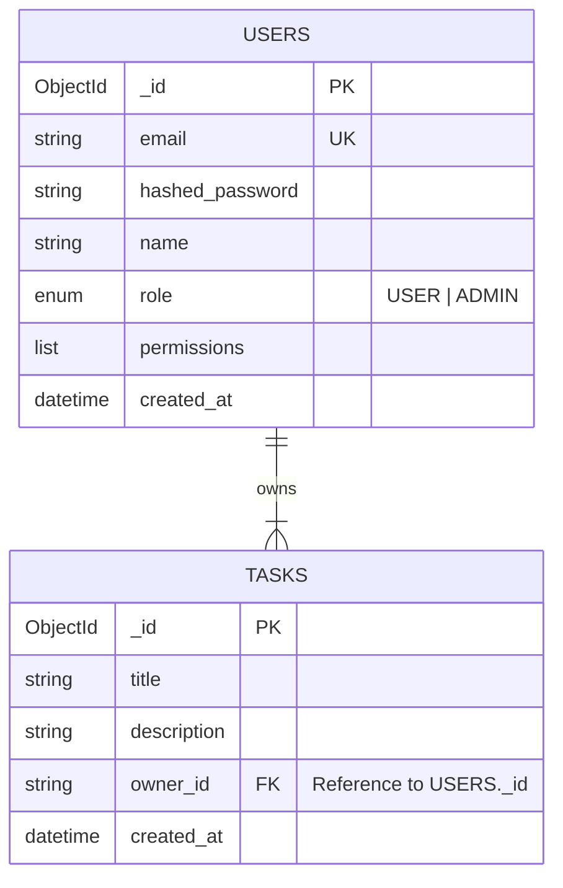

# Database Documentation

## Overview
The application uses **MongoDB** as its primary data store. Due to the document-oriented nature of MongoDB, we do not have rigid tables, but we enforce schemas using **Pydantic Models** in the application layer.

## Entity Relationship Diagram (ERD)

Although MongoDB is NoSQL, the entities have implicit relationships.

## Collection Details

### 1. Users Collection (`users`)
Stores all registered user information.
- **_id**: Automatically generated MongoDB ObjectId.
- **email**: Unique index ensures no duplicate registrations.
- **role**: Determines access level. Defaults to `USER`.
- **permissions**: List of granular permission strings (extensible).

### 2. Tasks Collection (`tasks`)
Stores to-do items for users.
- **_id**: Automatically generated MongoDB ObjectId.
- **owner_id**: A string representation of the User's ObjectId. This links the task to a specific user.
- **Index**: Typically indexed on `owner_id` for fast retrieval of a user's tasks.

## Implementation Details

### Model Validation
We use Pydantic models to validate data before it enters the database.
- **Location**: `backend/app/models/`
- **Files**: `user.py`, `task.py`

### ID Handling
MongoDB uses `_id` (ObjectId), but API clients typically expect `id` (string).
- Our Pydantic models use `Field(alias="_id")` to map the database `_id` to the API `id` field automatically.
