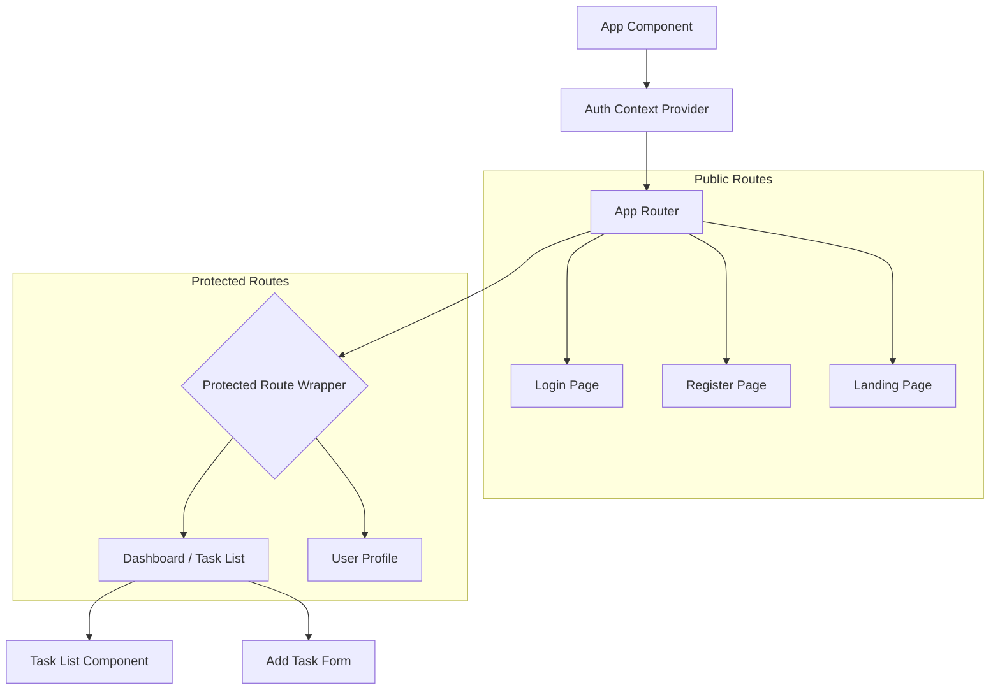
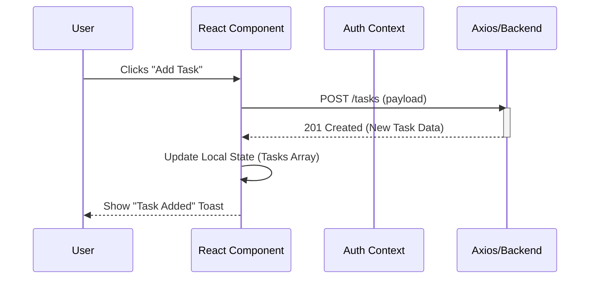

# Frontend Documentation

## Overview
The frontend is a modern Single Page Application (SPA) built with **React 19**, **Vite**, and **TypeScript**. It provides a responsive interface for users to manage their tasks and keeps track of authentication state using React Context.

## Tech Stack
- **Framework**: React 19
- **Build Tool**: Vite
- **Language**: TypeScript
- **State Management**: React Context API
- **Routing**: React Router DOM v7
- **HTTP Client**: Axios

## Component Architecture

The application is structured around a central Authentication Context that provides user state to all pages.

## Implementation Details

### 1. Authentication Context (`src/context/AuthContext.tsx`)
This is the heart of the frontend state.
- **State**: `user` (User object | null), `token` (string | null), `isAuthenticated` (boolean).
- **Actions**: `login(token)`, `logout()`.
- **Persistance**: Checks `localStorage` on load to restore the session.

### 2. API Integration (`src/api/axios.ts`)
We use a centralized Axios instance.
- **Interceptors**: Automatically attaches the `Authorization: Bearer <token>` header to every request if a token exists in the context/storage.
- **Base URL**: Configured to point to the FastAPI backend.

### 3. Protected Routes
A wrapper component checks the `isAuthenticated` flag.
- **If True**: Renders the child component (e.g., Dashboard).
- **If False**: Redirects to `/login`.

### 4. Task Management Flow

