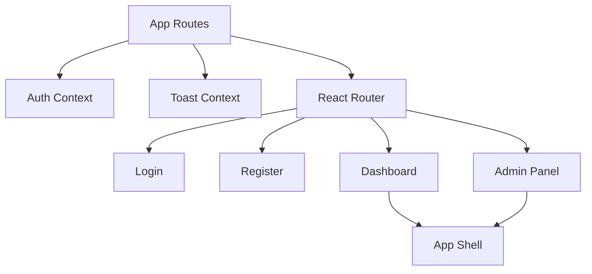
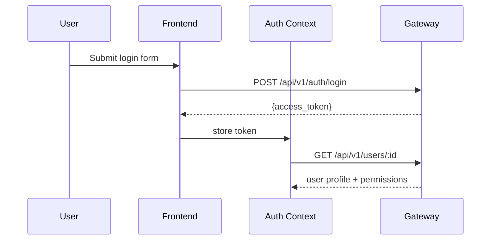

# Frontend Architecture

## Overview
The frontend is a React + TypeScript single page app built with Vite. It handles authentication, task management, and admin user management while enforcing permission-based UI gates.

## Tech Stack
- React 19 + TypeScript
- Vite build tooling
- React Router DOM
- Fetch-based API client
- Context API for auth + toasts

## High-Level Architecture

```mermaid
graph TD
    App[App Routes] --> AuthProvider[Auth Context]
    App --> ToastProvider[Toast Context]
    App --> Router[React Router]

    Router --> Login[Login]
    Router --> Register[Register]
    Router --> Dashboard[Dashboard]
    Router --> AdminPanel[Admin Panel]

    Dashboard --> AppShell[App Shell]
    AdminPanel --> AppShell
```

## Routing and Guards
- Routes are defined in `App.tsx`.
- `ProtectedRoute` redirects unauthenticated users to `/login`.
- Admin users are redirected to `/admin` by default.
- Permission-based gates hide actions (create, edit, delete) when the user does not have the required permission.

## Authentication Flow
1. User signs in via `/auth/login`.
2. JWT is stored in `localStorage` and decoded in the auth context.
3. The app fetches `/users/:id` to hydrate permissions and profile details.
4. Auth state drives routing and permission gates.

```mermaid
sequenceDiagram
    participant U as User
    participant UI as Frontend
    participant A as Auth Context
    participant API as Gateway

    U->>UI: Submit login form
    UI->>API: POST /api/v1/auth/login
    API-->>UI: {access_token}
    UI->>A: store token
    A->>API: GET /api/v1/users/:id
    API-->>A: user profile + permissions
```

## Permissions and UI Gating
- `read:tasks` controls task list visibility.
- `write:tasks` controls create and edit actions.
- `delete:tasks` controls delete actions.
- `manage:users` controls access to admin user management UI.

## API Client
- The client in `src/api/client.ts` adds `Authorization: Bearer <token>` when a token is present.
- Base URL defaults to `/api/v1`, routed via the gateway container.

## Key Files
- `src/App.tsx`: routes and auth redirects.
- `src/context/AuthContext.tsx`: token handling, profile hydration, permission state.
- `src/context/ToastContext.tsx`: toast notifications.
- `src/pages/Dashboard.tsx`: task CRUD UI with permission gates.
- `src/pages/AdminPanel.tsx`: user management UI with permission gates.
- `src/components/AppShell.tsx`: top bar and layout shell.
- `src/components/ServiceHealth.tsx`: gateway health indicator.
