# From Docker Compose to AWS EKS: Building and Operating a Cloud-Native Microservices Platform

Most tutorials end when the application works.

Real engineering begins when you ask:

* Can it scale?
* Can it recover from failures?
* Can it be deployed repeatedly without manual effort?
* Can it be monitored?
* Can it survive infrastructure failures?

Over the last few months, I transformed a simple FastAPI + React application into a cloud-native microservices platform running on Amazon EKS with automated CI/CD, persistent storage, service-to-service communication, and deployment automation.

This article shares the architecture, lessons learned, and the roadmap ahead.

---

# The Starting Point

The project began as a traditional full-stack application:

* React Frontend
* FastAPI Backend
* MongoDB Database

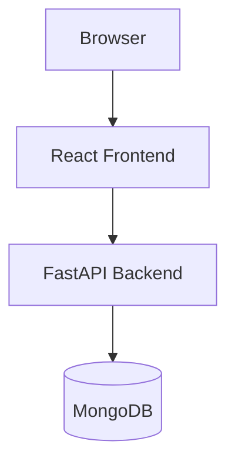

The architecture worked perfectly for local development but had several limitations:

* Single deployment unit
* Single point of failure
* Limited scalability
* Tight coupling between features
* Manual deployment process

As the project grew, it became clear that a more scalable architecture was needed.

---

# Building a Strong Foundation

Before introducing microservices, several foundational improvements were implemented.

## 1. Type-Safe Request Validation

FastAPI and Pydantic were used to ensure strict validation before business logic execution.

### Benefits

* Automatic request validation
* Strong typing
* Consistent API contracts
* Better developer experience

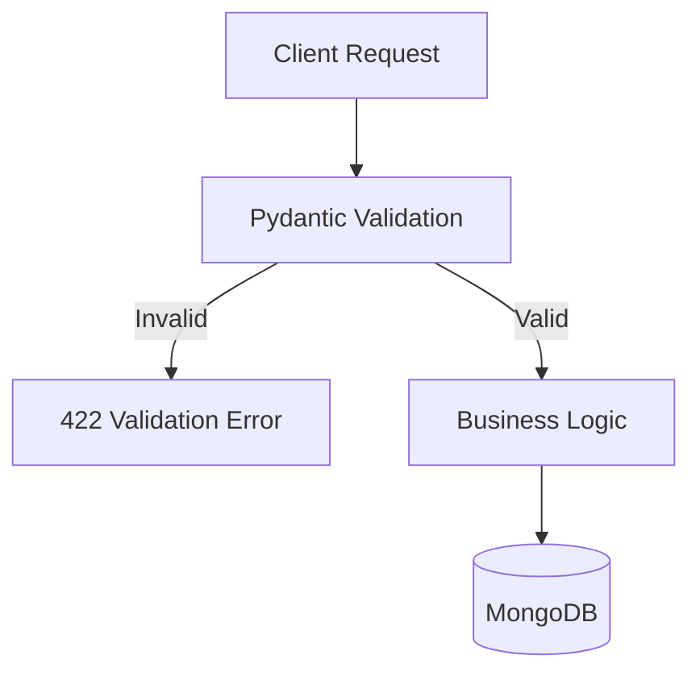

---

## 2. JWT Authentication and RBAC

Authentication was implemented using JWT tokens combined with role-based authorization.

### Benefits

* Stateless authentication
* Secure API access
* Scalable authorization model
* Separation of concerns

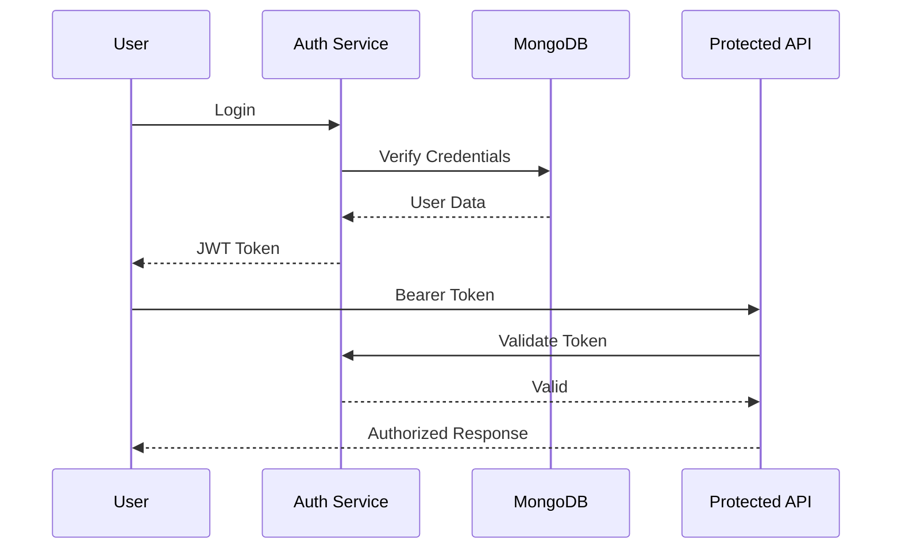

---

## 3. Containerization

The entire application stack was containerized.

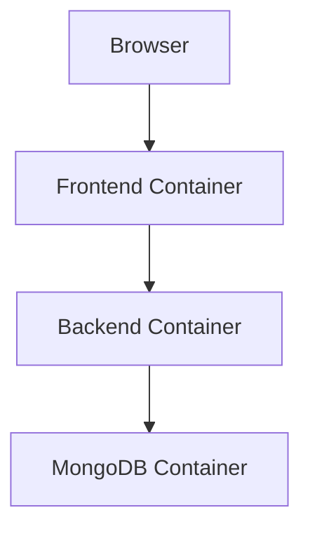

Benefits:

* Reproducible environments
* Environment consistency
* Simplified onboarding
* Easier deployment

---

# Service Decomposition

As features expanded, the backend was split into independent services.

The architecture evolved from a monolith into a microservices-based platform.

### Services

* API Gateway
* Auth Service
* User Service
* Task Service

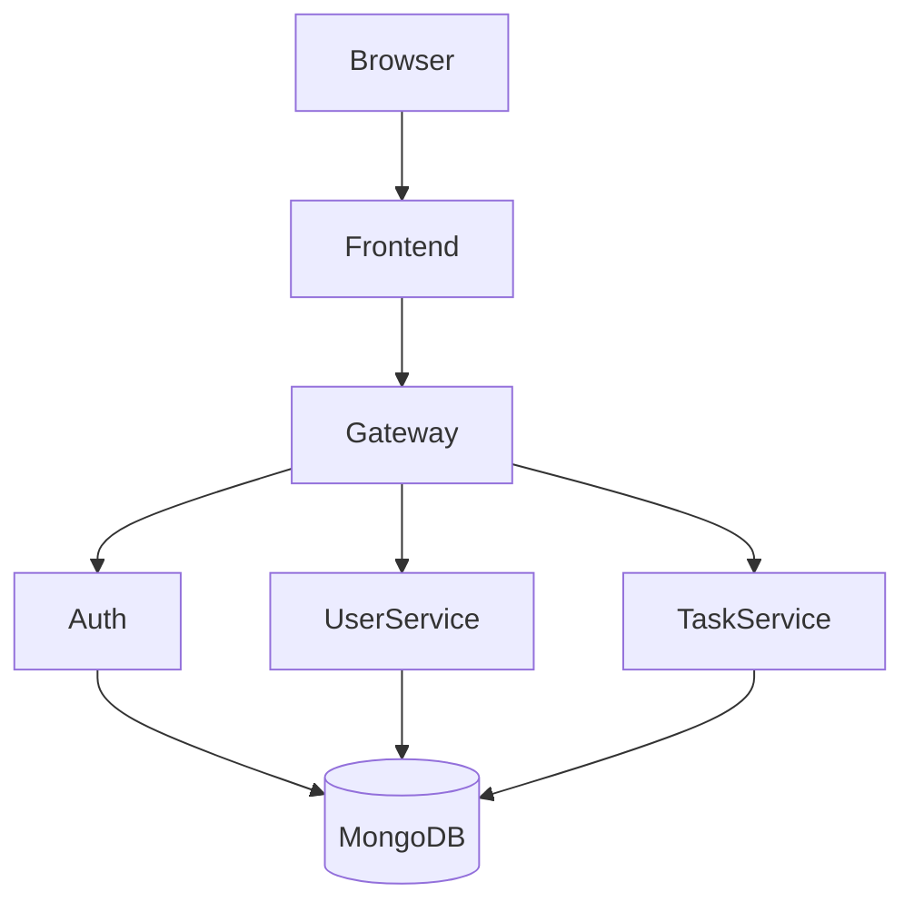

### Benefits

* Independent deployment
* Independent scaling
* Better fault isolation
* Cleaner code ownership

---

# Event-Driven Communication with RabbitMQ

To reduce coupling and support asynchronous workflows, RabbitMQ was introduced.

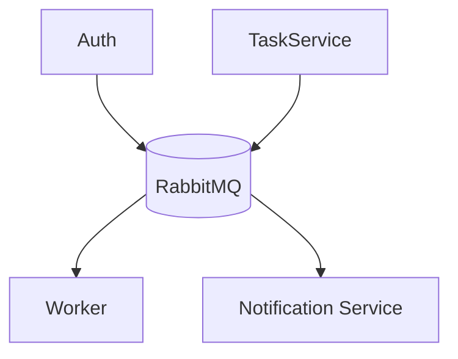

Benefits:

* Decoupled services
* Reliable message delivery
* Improved scalability
* Event-driven architecture

---

# Kubernetes Migration

Docker Compose was excellent for development.

Kubernetes was introduced to manage production workloads.

The platform was migrated to Amazon EKS.

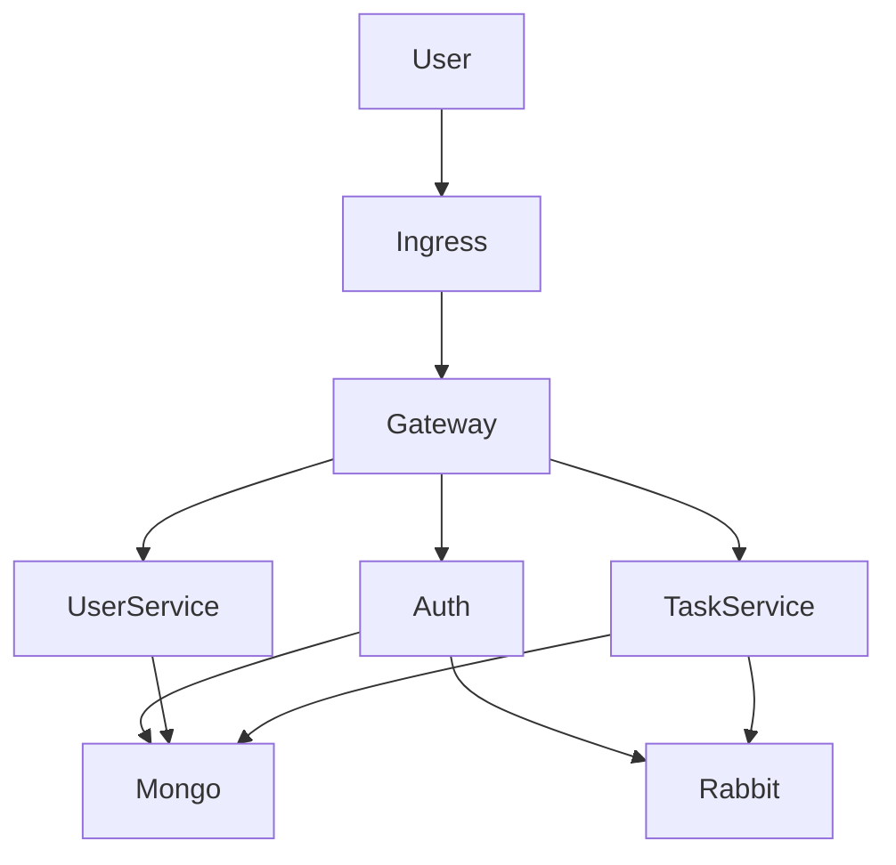

---

# Amazon EKS Deployment

The project now runs on Amazon Elastic Kubernetes Service (EKS).

### Platform Components

* Amazon EKS
* Amazon ECR
* EBS CSI Driver
* Kubernetes Deployments
* Services
* Ingress
* Persistent Volumes

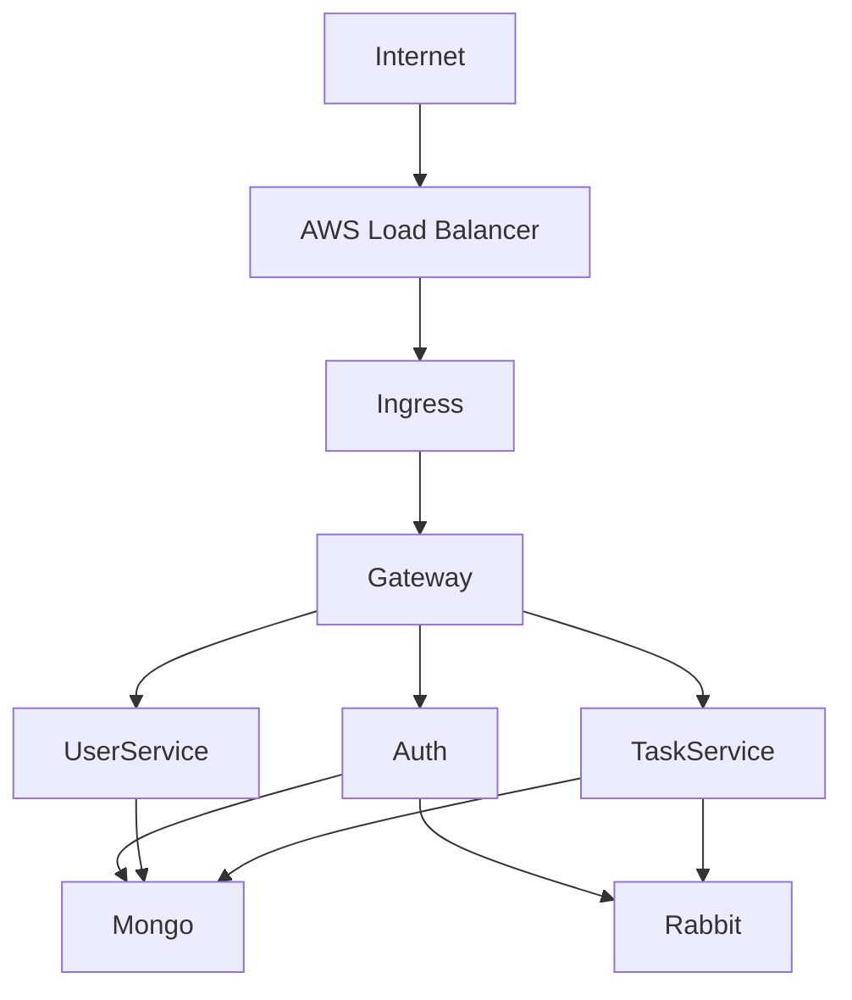

---

# Persistent Storage with EBS CSI

Databases require durable storage.

MongoDB uses Persistent Volume Claims backed by AWS EBS.

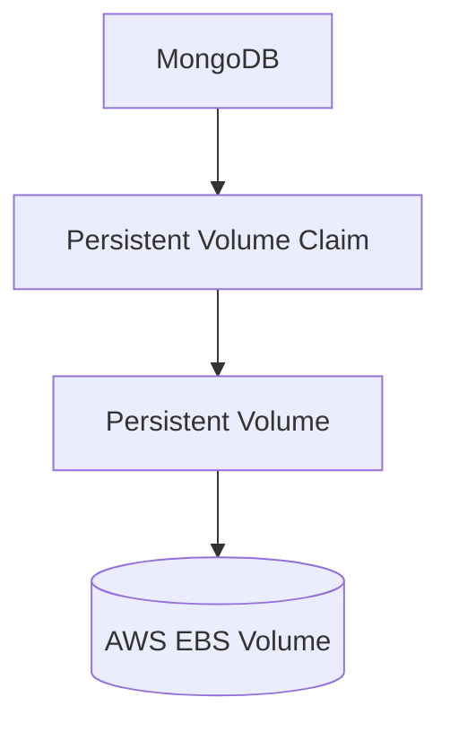

Benefits:

* Persistent storage
* Dynamic provisioning
* Automated volume management
* Data durability

---

# Service Discovery and Networking

Kubernetes service discovery replaced static IP configurations.

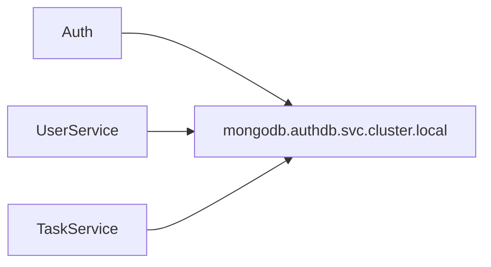

Benefits:

* Dynamic networking
* Service abstraction
* Easier scaling

---

# Reliability Engineering

Every service implements readiness and liveness probes.

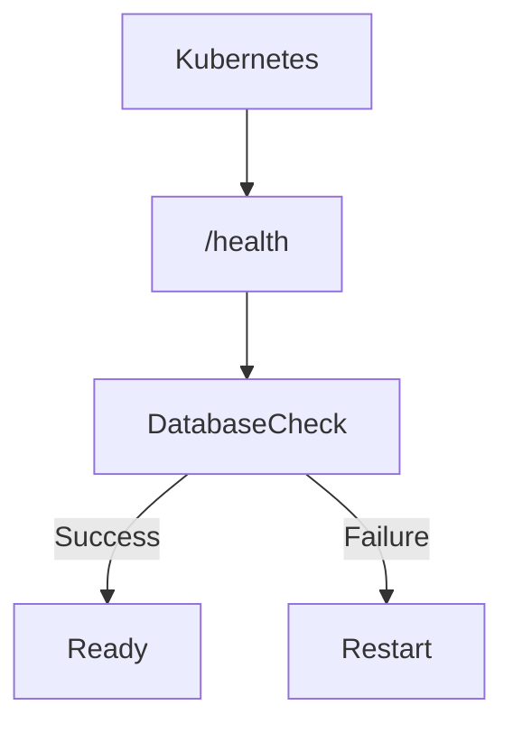

Benefits:

* Self-healing workloads
* Faster failure detection
* Improved uptime

---

# CI/CD with GitHub Actions

Manual deployments do not scale.

To automate the release process, GitHub Actions was integrated into the platform.

### Pipeline Responsibilities

* Build Docker images
* Run validations
* Push images to Amazon ECR
* Deploy to EKS
* Verify deployments

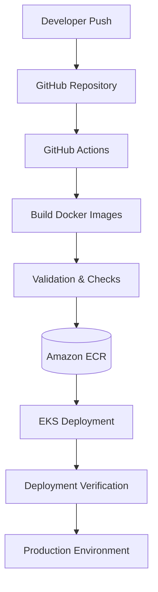

### Benefits

* Faster deployments
* Reduced manual errors
* Consistent release process
* Improved developer productivity

---

# Deployment Automation

Operational tasks were automated through deployment scripts.

```text
scripts/
├── preflight.sh
├── deploy.sh
├── healthcheck.sh
├── rollback.sh
├── cleanup.sh
├── backup-mongodb.sh
├── port-forward-access.sh
└── startup-launch-app.sh
```

Deployment workflow:

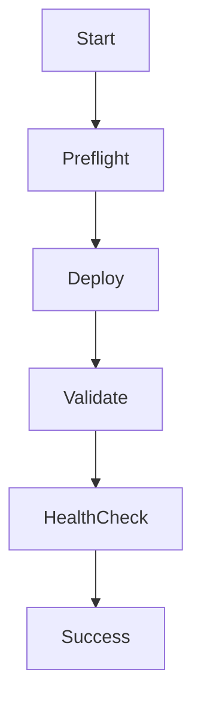

---

# Current Platform Architecture

Today the platform looks like this:

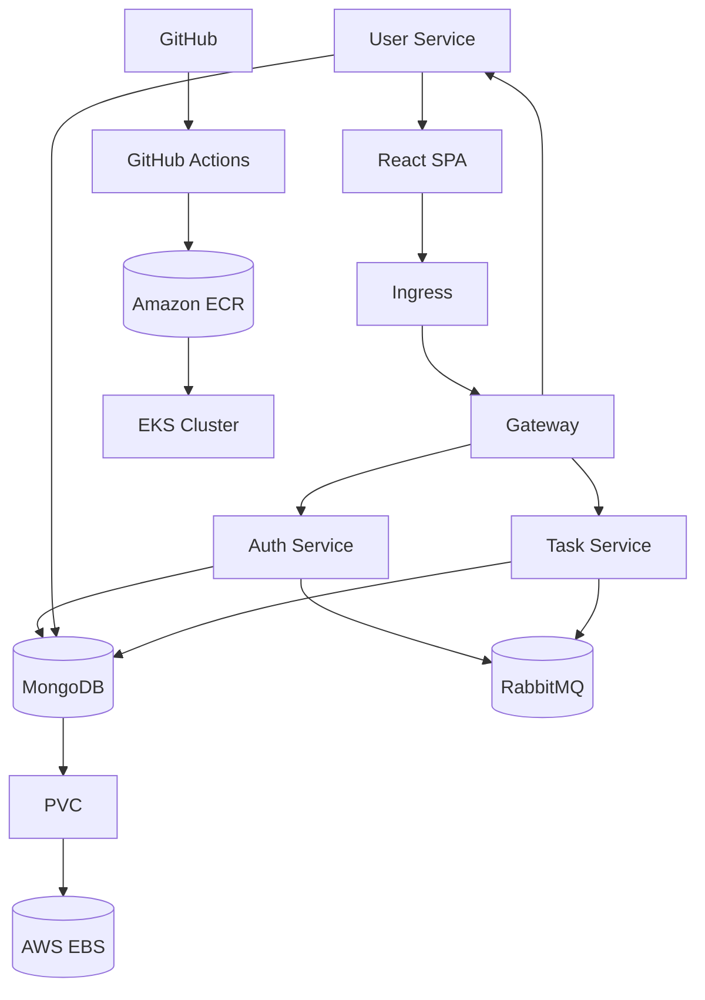

---

# DevOps Maturity Journey

The project evolved through multiple stages.

```text
Phase 1
Local Full-Stack Application
✓ React
✓ FastAPI
✓ MongoDB

Phase 2
Containerized Platform
✓ Docker
✓ Docker Compose

Phase 3
Microservices
✓ Auth Service
✓ User Service
✓ Task Service
✓ RabbitMQ

Phase 4
Cloud Infrastructure
✓ Amazon EKS
✓ Amazon ECR
✓ EBS CSI
✓ Kubernetes Networking

Phase 5
DevOps Automation
✓ GitHub Actions
✓ Deployment Automation
✓ Health Checks
✓ Backup Scripts

Phase 6 (Current Roadmap)
□ Prometheus
□ Grafana
□ Alertmanager
□ HPA
□ Redis

Phase 7 (Future)
□ Terraform
□ ArgoCD
□ GitOps
□ Distributed Tracing
□ Service Mesh
□ Multi-Region Deployment
```

---

# Key Lessons Learned

### 1. Containerization is only the beginning

Docker solves packaging problems.

Operating distributed systems introduces a completely different set of challenges.

### 2. Infrastructure becomes software

Kubernetes, IAM, EBS, ECR, and CI/CD pipelines should be treated as code.

### 3. Observability matters

You cannot operate what you cannot measure.

Monitoring and alerting are not optional.

### 4. Automation reduces risk

Every manual step becomes a potential point of failure.

### 5. Real learning happens during failures

EBS CSI issues, PVC binding failures, image pull errors, IAM misconfigurations, and deployment troubleshooting provided some of the most valuable learning experiences.

---

# What's Next?

The next milestone is building a complete observability and GitOps platform.

Planned stack:

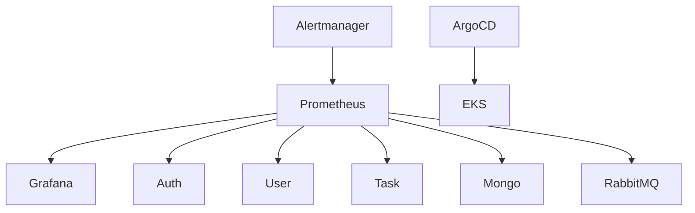

Future goals:

* Full monitoring
* Centralized logging
* Auto-scaling
* Infrastructure as Code
* GitOps-based deployments
* Distributed tracing

---

# Tech Stack

### Application Layer

* React
* TypeScript
* FastAPI
* Python 3.13

### Data Layer

* MongoDB
* RabbitMQ

### Container Platform

* Docker
* Kubernetes

### Cloud Platform

* Amazon EKS
* Amazon ECR
* Amazon EBS
* IAM

### DevOps

* GitHub Actions
* Bash Automation
* Helm

---

Building the application was only part of the journey.

Building the platform that runs the application taught me far more about cloud infrastructure, distributed systems, automation, reliability engineering, and operational excellence than writing the application itself.

**What was the biggest challenge you faced when moving from local development to production infrastructure?**
