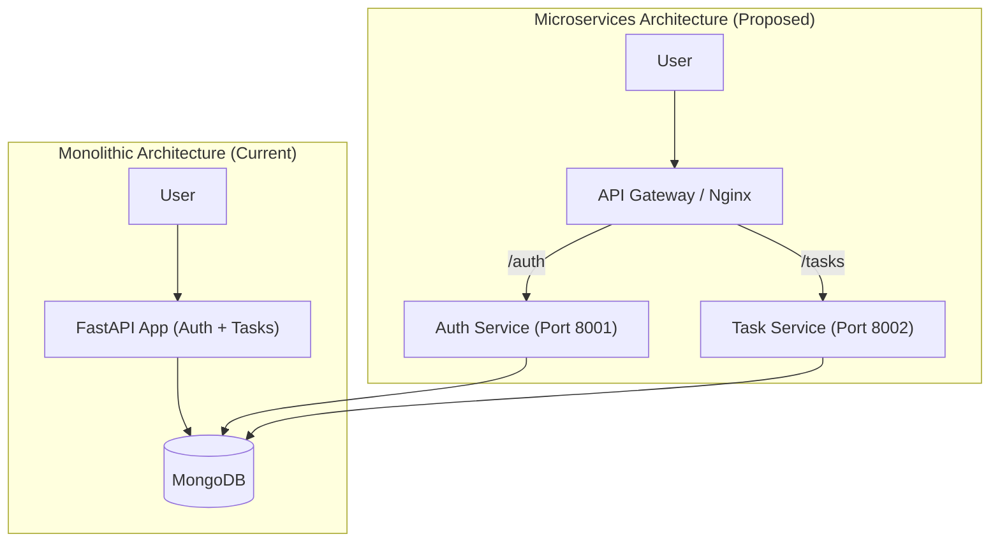
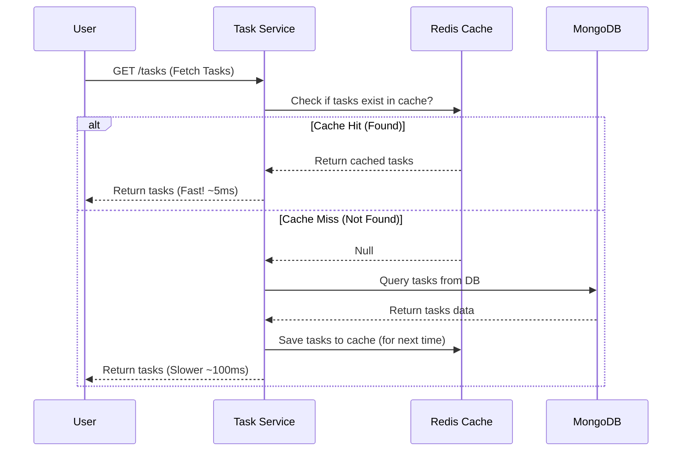
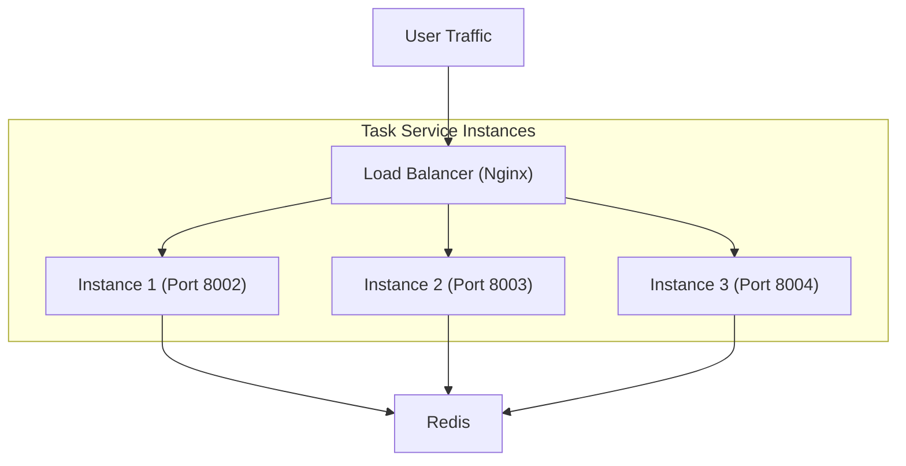

# Scalability Implementation Guide for AuthDB

This is how we can scale the current Monolithic FastAPI application into a scalable, distributed system.   It includes visual diagrams to help you conceptualize and explain these architectures during an interview.

---

## 1. Current Architecture (Monolith) vs. Microservices (Split Logic)

**"Splitting authentication and business logic into separate microservices."**

### Concept: "The One-Man Show" vs. "Specialized Teams"
Currently, your `backend/app/main.py` is a monolith. It handles everything. We want to split it.

### Visual Diagram

**Explanation**:
"Currently, my app is a Monolith where `main.py` handles both Auth and Tasks. I would split this into two services:
1.  **Auth Service**: Handles login/registration (Port 8001).
2.  **Task Service**: Handles todo lists (Port 8002).
This allows me to scale the Task service independently if it gets heavy traffic."

---

## 2. Caching Strategy (Redis)

**"Redis can be used for caching frequent reads."**

### Concept: "The Sticky Note"
Database queries are slow. Redis (memory) is fast. We check Redis first.

### Visual Diagram

**Explanation**:
"I would use Redis to cache the list of tasks. When a user creates a task (`cache invalidation`), I clear the cache so they always see fresh data. This drastically reduces the load on MongoDB."

---

## 3. Load Balancing

**"Load balancing can distribute traffic across multiple instances."**

### Concept: "The Traffic Cop"
Run multiple copies of your code and distribute users among them.

### Visual Diagram

**Explanation**:
"To handle more users, I would run 3 instances of my Task Service using Docker. A Load Balancer (like Nginx) sits in front and distributes requests. If Instance 1 is busy, it sends the user to Instance 2."

---

## Summary Table for Interview

| Concept | The "What" | The "Why" | In Your Code |
| :--- | :--- | :--- | :--- |
| **Microservices** | Splitting `main.py` into `auth.py` and `tasks.py` servers. | Independent scaling & fault isolation. | `AuthService` handles tokens; `TaskService` verifies them. |
| **Redis** | Storing `GET /tasks` results in RAM. | Speed (ms vs s) & database protection. | Check Redis before `await db.tasks.find()`. |
| **Load Balancing** | Nginx distributing requests to 3 Docker containers. | Handling high traffic & redundancy. | Traffic -> Nginx -> [Container A, B, C]. |
